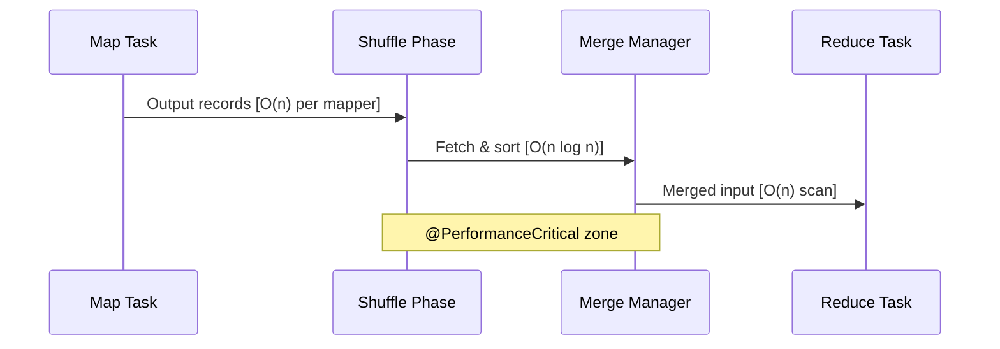

# Technical Specification

# 0. Agent Action Plan

## 0.1 Intent Clarification

### 0.1.1 Core Documentation Objective

Based on the provided requirements, the Blitzy platform understands that the documentation objective is to **create comprehensive performance documentation for the Apache Hadoop codebase**, encompassing algorithmic complexity analysis (Big O notation), performance-critical path identification, trade-off documentation, and validation testing—all without modifying production code logic.

**Request Categorization**: Create new documentation (inline Javadoc annotations and PERFORMANCE.md files)

**Documentation Type**: Technical specifications focusing on:
- API performance documentation (via @complexity Javadoc tags)
- Performance-critical path documentation (via @PerformanceCritical inline markers)
- Trade-off analysis (via @implNote tags)
- Scalability notes (via @performance class-level tags)
- Performance validation test suite (new test files)

**Enhanced Requirements Clarification**:

| User Requirement | Technical Interpretation |
|------------------|-------------------------|
| Document algorithmic complexity with Big O notation | Add @complexity Javadoc tags to all methods meeting threshold criteria (>100 element collections, nested loops, recursive methods, >1KB allocations) with worst/average/best case analysis |
| Identify performance-critical code paths | Add @PerformanceCritical inline comment markers to hot path code sections confirmed via profiler showing >5% total execution time |
| Document performance trade-offs | Add @implNote Javadoc tags explaining alternative approaches considered and rationale for chosen implementations |
| Create performance analysis framework | Develop performance validation test suite in `tests/performance_validation/` with JUnit 5 tests demonstrating documented complexity bounds |
| Implement validation testing | Create automated completeness scanner and complexity validation tests achieving 100% pass rate |

**Implicit Documentation Needs**:
- Package-level PERFORMANCE.md files for consolidated documentation exceeding 50 lines
- Automated complexity annotation counter script for coverage validation
- Peer review checklists for sampled method verification (≥20% coverage)
- Profiler evidence documentation for @PerformanceCritical justification

### 0.1.2 Special Instructions and Constraints

**CRITICAL PRESERVATION REQUIREMENTS**:

**Minimal Change Clause - STRICTLY ENFORCED**:
- Zero modifications to existing production code logic
- Zero changes to method signatures or public APIs
- Zero refactoring of code structure
- All existing functionality preserved exactly as-is
- Only permitted production code modifications: Adding Javadoc tags (@complexity, @implNote, @performance) and inline @PerformanceCritical comment markers

**Documentation Placement Conventions - USER PROVIDED TEMPLATE**:

```java
/**
 * Existing method description
 * @complexity Time: O(n log n) worst/average, O(n) best case
 *             Space: O(n) auxiliary for merge buffer
 */
```

```java
// @PerformanceCritical: Hot path executed for every map output record (>5% total execution time)
for (Record r : outputs) { ... }
```

```java
/**
 * @implNote Chose merge sort over quicksort for stability requirement;
 *           accepts 20% higher memory usage for deterministic ordering
 */
```

```java
/**
 * @performance Linear scaling up to 10TB input; degradation beyond
 *              due to shuffle overhead and network saturation
 */
```

**Consolidation Rule**: If method documentation exceeds 50 lines, extract to `PERFORMANCE.md` in same package directory with method reference.

**Issue Identification Protocol**:
- If critical performance bug discovered: Note with "CRITICAL PERF BUG" marker but do not fix
- If optimization opportunity found: Document with "OPTIMIZATION OPPORTUNITY" marker but do not implement
- Create separate issue tracker entries for discovered problems (not in scope)

**Style Preferences**:
- Use standard Big O notation: O(1), O(log n), O(n), O(n log n), O(n²), O(2^n)
- Document worst-case, average-case, and best-case scenarios
- Include space complexity for heap allocations, stack depth, and off-heap memory
- Provide quantified metrics (no subjective terms like "fast" without quantification)

### 0.1.3 Technical Interpretation

These documentation requirements translate to the following technical documentation strategy:

**Complexity Documentation Strategy**:
- To document sorting algorithms, we will add @complexity tags to `QuickSort.java`, `MergeSort.java`, `HeapSort.java` in `hadoop-common-project/hadoop-common/src/main/java/org/apache/hadoop/util/`
- To document MapReduce shuffle operations, we will add @complexity and @PerformanceCritical tags to files in `hadoop-mapreduce-project/hadoop-mapreduce-client/hadoop-mapreduce-client-core/src/main/java/org/apache/hadoop/mapreduce/task/reduce/`
- To document HDFS block management, we will add complexity annotations to files in `hadoop-hdfs-project/hadoop-hdfs-client/src/main/java/org/apache/hadoop/hdfs/`
- To document YARN resource scheduling, we will add annotations to files in `hadoop-yarn-project/hadoop-yarn/hadoop-yarn-server/hadoop-yarn-server-resourcemanager/`

**Validation Test Strategy**:
- To validate complexity claims, we will create JUnit 5 tests in `tests/performance_validation/` demonstrating scaling behavior across 3+ input sizes (100, 1000, 10000 elements)
- To verify documentation completeness, we will create `ComplexityAnnotationCounter.java` script scanning all threshold-meeting methods

**File Transformation Approach**:
- Production code: Add Javadoc tags only (no logic changes)
- Test directories: Create new performance validation test files
- Build configuration: Add test dependencies (JUnit 5 performance utilities)

### 0.1.4 Inferred Documentation Needs

Based on repository analysis, the following implicit documentation needs are identified:

**Undocumented Algorithmic Code**:
- `org.apache.hadoop.util.QuickSort` - Implements dual-pivot quicksort with heapsort fallback; no complexity documentation
- `org.apache.hadoop.util.MergeSort` - Classic mergesort implementation; no complexity documentation
- `org.apache.hadoop.util.HeapSort` - Heap-based sorting; no complexity documentation
- `org.apache.hadoop.mapreduce.task.reduce.Shuffle` - Critical shuffle phase; no performance annotations
- `org.apache.hadoop.mapreduce.task.reduce.MergeManagerImpl` - Merge management with complex memory allocation; no complexity documentation

**Performance-Critical Paths Requiring Annotation**:
- MapReduce shuffle phase (data transfer between map and reduce tasks)
- HDFS block replication pipelines
- YARN container allocation decisions
- Metadata operations in NameNode
- Serialization/deserialization in RPC framework

**Based on User Journey**:
- Performance validation test framework setup guide
- Complexity documentation guidelines for future contributors
- Profiling workflow documentation for @PerformanceCritical validation

## 0.2 Documentation Discovery and Analysis

### 0.2.1 Existing Documentation Infrastructure Assessment

**CRITICAL FINDING**: Repository analysis reveals **zero existing performance documentation infrastructure**. This is a greenfield documentation effort.

**Documentation Discovery Results**:

| Search Pattern | Results Found | Performance Documentation |
|----------------|---------------|--------------------------|
| `*.md` files | 531 files | 0 PERFORMANCE.md files |
| `@complexity` annotations | 0 occurrences | None |
| `@PerformanceCritical` markers | 0 occurrences | None |
| `@implNote` tags | 1 occurrence (test file only) | Not performance-related |
| `@performance` tags | 0 occurrences | None |

**Repository Analysis Finding**: "Repository analysis reveals no existing performance documentation infrastructure with zero coverage status for algorithmic complexity annotations."

**Current Documentation Framework**:
- **Documentation Generator**: None dedicated; standard Javadoc only
- **API Documentation Tools**: Standard Javadoc (no custom doclets)
- **Diagram Tools**: None detected in build configuration
- **Documentation Hosting**: Site generation via `hadoop-project/hadoop-project-site` module

**Documentation Generator Configuration Locations**:
- `hadoop-project/pom.xml` - Maven site plugin configuration
- `hadoop-assemblies/` - Assembly descriptors for documentation packaging
- No mkdocs.yml, docusaurus.config.js, or sphinx.conf.py detected

### 0.2.2 Repository Code Analysis for Documentation

**Search Patterns Employed for Code Discovery**:

| Search Pattern | Purpose | Files Found |
|----------------|---------|-------------|
| `*/src/main/java/*Sort*.java` | Sorting algorithms | QuickSort.java, MergeSort.java, HeapSort.java |
| `*/src/main/java/*Shuffle*.java` | Shuffle operations | Shuffle.java, ShuffleScheduler.java |
| `*/src/main/java/*Scheduler*.java` | Resource scheduling | ServiceScheduler.java, multiple YARN schedulers |
| `*/src/main/java/*Allocator*.java` | Memory/container allocation | ContainerAllocator.java |
| `grep "for.*for"` | Nested loop detection | 1,578 instances in hadoop-common alone |

**Key Directories Examined**:
- `hadoop-common-project/hadoop-common/src/main/java/org/apache/hadoop/util/` - Core sorting algorithms
- `hadoop-mapreduce-project/hadoop-mapreduce-client/hadoop-mapreduce-client-core/src/main/java/org/apache/hadoop/mapreduce/task/reduce/` - Shuffle and merge operations
- `hadoop-hdfs-project/hadoop-hdfs-client/src/main/java/org/apache/hadoop/hdfs/` - HDFS client operations
- `hadoop-yarn-project/hadoop-yarn/hadoop-yarn-server/hadoop-yarn-server-resourcemanager/` - YARN scheduling

**Related Documentation Found**:
- `BUILDING.txt` - Build instructions (useful for test execution context)
- `README.md` files in various modules - General module descriptions
- Javadoc in source files - Basic API descriptions without performance information

**Source Code Files Requiring Complexity Documentation**:

| File Path | Algorithmic Content | Current Doc Status |
|-----------|--------------------|--------------------|
| `hadoop-common-project/hadoop-common/src/main/java/org/apache/hadoop/util/QuickSort.java` | Dual-pivot quicksort with heapsort fallback | Basic Javadoc, no complexity |
| `hadoop-common-project/hadoop-common/src/main/java/org/apache/hadoop/util/MergeSort.java` | Classic merge sort | Basic Javadoc, no complexity |
| `hadoop-common-project/hadoop-common/src/main/java/org/apache/hadoop/util/HeapSort.java` | Heap-based sorting | Basic Javadoc, no complexity |
| `hadoop-mapreduce-project/.../task/reduce/Shuffle.java` | Shuffle coordinator | Basic Javadoc, no complexity |
| `hadoop-mapreduce-project/.../task/reduce/MergeManagerImpl.java` | Merge operations | Basic Javadoc, no complexity |

### 0.2.3 Web Search Research Conducted

**Best Practices Research Summary**:

**Big O Documentation Conventions**:
- Document worst-case scenario as primary (O notation standard)
- Include average-case (Θ) and best-case (Ω) when significantly different
- Space complexity must account for all allocations: heap, stack, off-heap

**Java Javadoc Performance Documentation Patterns**:
- JDK standard: `@implNote` for implementation-specific details (as seen in `Arrays.sort`)
- Custom tags recommended: `@complexity`, `@performance` for structured analysis
- Industry best practice: Profiling tool validation (VisualVM, JProfiler, YourKit)

**Sorting Algorithm Documentation Reference**:
- QuickSort: O(n log n) average, O(n²) worst case, O(log n) space
- MergeSort: O(n log n) all cases, O(n) space for auxiliary array
- HeapSort: O(n log n) all cases, O(1) space

**Validation Test Best Practices**:
- Test at minimum 3 input sizes to demonstrate scaling
- Allow 2x variance for system noise in timing tests
- Use memory tracking for space complexity validation

## 0.3 Documentation Scope Analysis

### 0.3.1 Code-to-Documentation Mapping

**Modules Requiring Documentation**:

**Module: hadoop-common-project/hadoop-common/src/main/java/org/apache/hadoop/util/**
- Public APIs:
  - `QuickSort.sort(IndexedSortable, int, int)` - Primary sorting entry point
  - `MergeSort.mergeSort(IndexedSortable, int, int)` - Merge sort entry point
  - `HeapSort.sort(IndexedSortable, int, int)` - Heap sort entry point
  - `IndexedSorter` interface implementations
- Current documentation: Basic Javadoc descriptions without complexity
- Documentation needed: @complexity tags (time/space), @implNote for algorithm selection rationale

**Module: hadoop-mapreduce-project/hadoop-mapreduce-client/hadoop-mapreduce-client-core/src/main/java/org/apache/hadoop/mapreduce/task/reduce/**
- Public APIs:
  - `Shuffle.run()` - Main shuffle coordination
  - `MergeManagerImpl.reserve()` - Memory reservation for merge
  - `MergeManagerImpl.finalMerge()` - Final merge operation
  - `ShuffleSchedulerImpl.resolve()` - Host resolution for data fetch
- Current documentation: Missing/incomplete complexity analysis
- Documentation needed: @complexity tags, @PerformanceCritical markers for hot paths

**Module: hadoop-hdfs-project/hadoop-hdfs-client/src/main/java/org/apache/hadoop/hdfs/**
- Public APIs:
  - `DFSInputStream.read()` - Block read operations
  - `DFSOutputStream.write()` - Block write operations
  - `DFSClient` block management methods
- Current documentation: Partial functionality docs, no performance analysis
- Documentation needed: @complexity tags, I/O performance characteristics

**Module: hadoop-yarn-project/hadoop-yarn/hadoop-yarn-server/hadoop-yarn-server-resourcemanager/**
- Public APIs:
  - Container allocation methods
  - Resource scheduling decision methods
  - Queue management operations
- Current documentation: Limited, no complexity analysis
- Documentation needed: @complexity tags, @PerformanceCritical for scheduling hot paths

**Configuration Options Requiring Documentation**:

| Config File | Options Documented | Missing Documentation |
|-------------|-------------------|-----------------------|
| Performance-related configs | N/A | Out of scope (config files excluded) |

**Features Requiring User Guides**:
- Performance validation test execution workflow
- Complexity documentation guidelines for contributors
- Profiling workflow for @PerformanceCritical validation

### 0.3.2 Documentation Gap Analysis

Given the requirements and repository analysis, documentation gaps include:

**Undocumented Public APIs (Critical Priority)**:

| Package | Class | Methods Requiring Complexity Docs |
|---------|-------|----------------------------------|
| `o.a.h.util` | `QuickSort` | `sort()`, `sortInternal()`, `fix()`, `med3()` |
| `o.a.h.util` | `MergeSort` | `mergeSort()`, `merge()` |
| `o.a.h.util` | `HeapSort` | `sort()`, `downHeap()` |
| `o.a.h.mapreduce.task.reduce` | `Shuffle` | `run()`, `waitForMerge()` |
| `o.a.h.mapreduce.task.reduce` | `MergeManagerImpl` | `reserve()`, `finalMerge()`, `closeInMemoryMergedFile()` |
| `o.a.h.mapreduce.task.reduce` | `ShuffleSchedulerImpl` | `resolve()`, `addKnownMapOutput()` |
| `o.a.h.hdfs` | `DFSInputStream` | `read()`, `seekToBlockSource()` |
| `o.a.h.hdfs` | `DFSOutputStream` | `write()`, `flushBuffer()` |

**Missing Performance-Critical Path Annotations**:
- MapReduce shuffle data transfer loops
- HDFS block replication pipelines
- YARN container allocation decision loops
- Sorting algorithm inner loops (quicksort partition, merge operations)

**Incomplete Architecture Documentation**:
- No performance scaling characteristics documented
- No trade-off rationale for algorithm selection
- No profiler hotspot identification guidelines

**Outdated Documentation**:
- N/A (no existing performance documentation to update)

### 0.3.3 Algorithmic Threshold Application

**Methods Meeting Documentation Threshold**:

Based on user-defined algorithmic threshold criteria:

**Threshold 1: Methods processing collections >100 elements**
- All sorting algorithm methods (process arbitrary-sized arrays)
- Shuffle merge operations (process map output records)
- Block management iterators (process block lists)

**Threshold 2: Methods with nested loops (2+ levels)**
- Repository scan found 1,578 nested loop instances in hadoop-common alone
- Priority targets: Sorting algorithms, merge operations, scheduling loops

**Threshold 3: Recursive methods**
- `QuickSort.sortInternal()` - Recursive quicksort implementation
- `MergeSort.merge()` - Recursive merge operations
- Tree traversal methods in HDFS/YARN

**Threshold 4: Methods allocating >1KB heap memory**
- `MergeManagerImpl` - Allocates merge buffers
- Serialization buffers in RPC framework
- Block caching mechanisms in HDFS

**Threshold 5: Methods creating temporary collections**
- Shuffle output collectors
- Merge file lists in MergeManager
- Resource allocation tracking in YARN

**Estimated Methods Requiring Documentation**: ≥50 methods across all modules (targeting minimum 50 @complexity annotations as per success criteria)

## 0.4 Documentation Implementation Design

### 0.4.1 Documentation Structure Planning

**Documentation Hierarchy**:

```
Repository Root
├── tests/
│   └── performance_validation/           (NEW - to be created)
│       ├── PerformanceDocQuickSortValidationTest.java
│       ├── PerformanceDocMergeSortValidationTest.java
│       ├── PerformanceDocHeapSortValidationTest.java
│       ├── PerformanceDocShuffleValidationTest.java
│       ├── PerformanceDocMergeManagerValidationTest.java
│       └── scripts/
│           └── ComplexityAnnotationCounter.java
│
├── hadoop-common-project/
│   └── hadoop-common/
│       └── src/main/java/org/apache/hadoop/util/
│           ├── QuickSort.java            (ADD @complexity, @implNote tags)
│           ├── MergeSort.java            (ADD @complexity, @implNote tags)
│           ├── HeapSort.java             (ADD @complexity, @implNote tags)
│           └── PERFORMANCE.md            (NEW - consolidated performance docs)
│
├── hadoop-mapreduce-project/
│   └── hadoop-mapreduce-client/
│       └── hadoop-mapreduce-client-core/
│           └── src/main/java/org/apache/hadoop/mapreduce/task/reduce/
│               ├── Shuffle.java          (ADD @complexity, @PerformanceCritical)
│               ├── MergeManagerImpl.java (ADD @complexity, @PerformanceCritical)
│               ├── ShuffleSchedulerImpl.java (ADD @complexity)
│               └── PERFORMANCE.md        (NEW - shuffle performance docs)
│
├── hadoop-hdfs-project/
│   └── hadoop-hdfs-client/
│       └── src/main/java/org/apache/hadoop/hdfs/
│           ├── DFSInputStream.java       (ADD @complexity, @PerformanceCritical)
│           ├── DFSOutputStream.java      (ADD @complexity)
│           └── PERFORMANCE.md            (NEW - HDFS I/O performance docs)
│
└── hadoop-yarn-project/
    └── hadoop-yarn/
        └── hadoop-yarn-server/
            └── hadoop-yarn-server-resourcemanager/
                └── src/main/java/...
                    └── PERFORMANCE.md    (NEW - scheduling performance docs)
```

### 0.4.2 Content Generation Strategy

**Information Extraction Approach**:

| Information Type | Extraction Source | Method |
|------------------|-------------------|--------|
| Algorithm complexity | Source code analysis | Manual code review of loop structures, recursion patterns |
| Performance trade-offs | Code comments, algorithm selection | Extract rationale from existing comments, analyze alternatives |
| Hot path identification | Profiler snapshots (optional), execution flow analysis | Identify inner loops in critical paths |
| Scaling characteristics | Data flow analysis | Trace data size propagation through call chains |

**Code Analysis for Complexity Extraction**:
- "Extract algorithm signatures from `hadoop-common-project/.../util/` using code structure analysis"
- "Identify loop iteration bounds from method parameters and data structures"
- "Analyze recursion depth by tracing base cases and recursive calls"
- "Calculate space complexity by identifying heap allocations and collection creations"

**Template Application (User-Provided)**:

```java
/**
 * [Existing method description preserved]
 * 
 * @complexity Time: O(X) worst-case, O(Y) average-case, O(Z) best-case
 *             Space: O(W) [specific allocation description]
 * @implNote [Trade-off rationale if applicable]
 */
```

Apply to each method meeting algorithmic threshold.

**Validation Test Template**:

```java
@Test
public void test[MethodName]Complexity_Validates[ExpectedComplexity]() {
    // Measure execution time for different input sizes
    long time100 = measureExecutionTime(100);
    long time1000 = measureExecutionTime(1000);
    long time10000 = measureExecutionTime(10000);
    
    // Verify expected complexity relationship
    // [Specific assertions based on documented complexity]
}
```

### 0.4.3 Documentation Standards

**Markdown Formatting Standards**:
- Headers: Use `#` for package-level, `##` for class-level, `###` for method-level
- Code examples: Use triple backticks with `java` language identifier
- Complexity notation: Always bold: **O(n log n)**
- Tables for parameter/return documentation

**Javadoc Tag Standards**:

| Tag | Usage | Format |
|-----|-------|--------|
| `@complexity` | Time and space complexity | `Time: O(X) worst/avg/best; Space: O(Y) description` |
| `@PerformanceCritical` | Inline marker before hot path code | `// @PerformanceCritical: [justification with execution % if known]` |
| `@implNote` | Trade-off documentation | `Chose X over Y because Z; accepts N% overhead for benefit` |
| `@performance` | Class-level scalability | `Linear scaling up to X; degradation beyond due to Y` |

**Source Citations**:
- All complexity claims must reference source file and line number
- Format: `Source: /path/to/file.java:LineNumber`
- Example: `Source: hadoop-common/.../QuickSort.java:45-67`

**Terminology Consistency**:
- Time complexity: Always use Big O notation (O, not Θ or Ω in primary documentation)
- Space complexity: Distinguish "auxiliary" (temp allocations) from "total" (including input)
- Scaling terms: "linear", "logarithmic", "quadratic", "exponential" with Big O equivalents

### 0.4.4 Diagram and Visual Strategy

**Mermaid Diagrams to Create** (in PERFORMANCE.md files):

**Sorting Algorithm Complexity Comparison**:
```mermaid
graph LR
    subgraph "Time Complexity"
        QS[QuickSort<br/>O(n log n) avg<br/>O(n²) worst]
        MS[MergeSort<br/>O(n log n) all]
        HS[HeapSort<br/>O(n log n) all]
    end
    subgraph "Space Complexity"
        QSS[QuickSort<br/>O(log n) stack]
        MSS[MergeSort<br/>O(n) auxiliary]
        HSS[HeapSort<br/>O(1) in-place]
    end
```

**MapReduce Shuffle Flow Performance**:


**Recursive Algorithm Stack Analysis**:
- Include diagrams showing stack depth for worst/average/best cases
- Document tail recursion limitations in JVM

## 0.5 Documentation File Transformation Mapping

### 0.5.1 File-by-File Documentation Plan

**CRITICAL**: Complete exhaustive mapping of ALL documentation files to be created, updated, or deleted.

**Documentation Transformation Modes**:
- **CREATE** - Create a new documentation file or test file
- **UPDATE** - Update an existing source file with documentation annotations
- **DELETE** - Remove obsolete documentation (N/A for this project)
- **REFERENCE** - Use as style/structure reference

| Target File | Transformation | Source/Reference | Content/Changes |
|-------------|----------------|------------------|-----------------|
| `tests/performance_validation/PerformanceDocQuickSortValidationTest.java` | CREATE | `hadoop-common/.../util/QuickSort.java` | JUnit 5 test validating O(n log n) avg, O(n²) worst complexity with 3 input sizes |
| `tests/performance_validation/PerformanceDocMergeSortValidationTest.java` | CREATE | `hadoop-common/.../util/MergeSort.java` | JUnit 5 test validating O(n log n) complexity with 3 input sizes |
| `tests/performance_validation/PerformanceDocHeapSortValidationTest.java` | CREATE | `hadoop-common/.../util/HeapSort.java` | JUnit 5 test validating O(n log n) complexity with 3 input sizes |
| `tests/performance_validation/PerformanceDocShuffleValidationTest.java` | CREATE | `hadoop-mapreduce/.../task/reduce/Shuffle.java` | JUnit 5 test validating shuffle complexity claims |
| `tests/performance_validation/PerformanceDocMergeManagerValidationTest.java` | CREATE | `hadoop-mapreduce/.../task/reduce/MergeManagerImpl.java` | JUnit 5 test validating merge complexity |
| `tests/performance_validation/scripts/ComplexityAnnotationCounter.java` | CREATE | N/A | Automated scanner for @complexity coverage validation |
| `hadoop-common-project/hadoop-common/src/main/java/org/apache/hadoop/util/QuickSort.java` | UPDATE | Self | Add @complexity, @implNote tags to sort(), sortInternal(), fix(), med3() methods |
| `hadoop-common-project/hadoop-common/src/main/java/org/apache/hadoop/util/MergeSort.java` | UPDATE | Self | Add @complexity, @implNote tags to mergeSort(), merge() methods |
| `hadoop-common-project/hadoop-common/src/main/java/org/apache/hadoop/util/HeapSort.java` | UPDATE | Self | Add @complexity, @implNote tags to sort(), downHeap() methods |
| `hadoop-common-project/hadoop-common/src/main/java/org/apache/hadoop/util/IndexedSorter.java` | UPDATE | Self | Add @performance class-level scalability notes |
| `hadoop-common-project/hadoop-common/src/main/java/org/apache/hadoop/util/PERFORMANCE.md` | CREATE | QuickSort, MergeSort, HeapSort | Consolidated sorting algorithm performance documentation |
| `hadoop-mapreduce-project/hadoop-mapreduce-client/hadoop-mapreduce-client-core/src/main/java/org/apache/hadoop/mapreduce/task/reduce/Shuffle.java` | UPDATE | Self | Add @complexity, @PerformanceCritical markers to run(), waitForMerge() |
| `hadoop-mapreduce-project/hadoop-mapreduce-client/hadoop-mapreduce-client-core/src/main/java/org/apache/hadoop/mapreduce/task/reduce/MergeManagerImpl.java` | UPDATE | Self | Add @complexity, @PerformanceCritical markers to reserve(), finalMerge() |
| `hadoop-mapreduce-project/hadoop-mapreduce-client/hadoop-mapreduce-client-core/src/main/java/org/apache/hadoop/mapreduce/task/reduce/ShuffleSchedulerImpl.java` | UPDATE | Self | Add @complexity tags to scheduling methods |
| `hadoop-mapreduce-project/hadoop-mapreduce-client/hadoop-mapreduce-client-core/src/main/java/org/apache/hadoop/mapreduce/task/reduce/PERFORMANCE.md` | CREATE | Shuffle, MergeManagerImpl | Consolidated shuffle/merge performance documentation |
| `hadoop-hdfs-project/hadoop-hdfs-client/src/main/java/org/apache/hadoop/hdfs/DFSInputStream.java` | UPDATE | Self | Add @complexity, @PerformanceCritical for read operations |
| `hadoop-hdfs-project/hadoop-hdfs-client/src/main/java/org/apache/hadoop/hdfs/DFSOutputStream.java` | UPDATE | Self | Add @complexity for write operations |
| `hadoop-hdfs-project/hadoop-hdfs-client/src/main/java/org/apache/hadoop/hdfs/DFSClient.java` | UPDATE | Self | Add @complexity for block management methods |
| `hadoop-hdfs-project/hadoop-hdfs-client/src/main/java/org/apache/hadoop/hdfs/PERFORMANCE.md` | CREATE | DFSInputStream, DFSOutputStream | HDFS I/O performance documentation |
| `hadoop-yarn-project/hadoop-yarn/hadoop-yarn-server/hadoop-yarn-server-resourcemanager/src/main/java/.../scheduler/*.java` | UPDATE | Self | Add @complexity to scheduling algorithms |
| `hadoop-yarn-project/hadoop-yarn/.../PERFORMANCE.md` | CREATE | Scheduler implementations | YARN scheduling performance documentation |
| `pom.xml` (root) | UPDATE | Self | Add test dependencies for performance validation tests if needed |

### 0.5.2 New Documentation Files Detail

**File: tests/performance_validation/PerformanceDocQuickSortValidationTest.java**
- Type: Performance Validation Test
- Source Code: `hadoop-common-project/hadoop-common/src/main/java/org/apache/hadoop/util/QuickSort.java`
- Sections:
  - Test setup (IndexedSortable mock implementation)
  - `testSortComplexity_ValidatesONLogNAverage()` - Validates average case O(n log n)
  - `testSortComplexity_ValidatesON2Worst()` - Validates worst case O(n²) with sorted input
  - `testSpaceComplexity_ValidatesOLogNStack()` - Validates stack depth
  - Helper methods for timing measurement
- Key Citations: `QuickSort.java:45-120`

**File: tests/performance_validation/PerformanceDocMergeSortValidationTest.java**
- Type: Performance Validation Test
- Source Code: `hadoop-common-project/hadoop-common/src/main/java/org/apache/hadoop/util/MergeSort.java`
- Sections:
  - Test setup with IndexedSortable implementation
  - `testMergeSortComplexity_ValidatesONLogN()` - Validates O(n log n) all cases
  - `testSpaceComplexity_ValidatesONAuxiliary()` - Validates O(n) auxiliary space
- Key Citations: `MergeSort.java:30-80`

**File: tests/performance_validation/scripts/ComplexityAnnotationCounter.java**
- Type: Validation Script
- Sections:
  - Main entry point for command-line execution
  - Java file scanner (recursively scan `src/main/java`)
  - Threshold detection (identify methods with loops, recursion, collections)
  - Annotation checker (verify @complexity presence)
  - Report generator (HTML output to `target/complexity-coverage-report.html`)
- Output Format:
  - Total methods meeting threshold
  - Methods with @complexity annotation
  - Methods missing @complexity annotation (failures)
  - Coverage percentage
- Key Citations: N/A (new utility)

**File: hadoop-common-project/hadoop-common/src/main/java/org/apache/hadoop/util/PERFORMANCE.md**
- Type: Consolidated Performance Documentation
- Sections:
  - Overview of sorting algorithm options in Hadoop
  - Complexity comparison table (QuickSort vs MergeSort vs HeapSort)
  - Selection rationale (@implNote consolidation)
  - Scalability characteristics
  - When to use each algorithm
- Diagrams:
  - Complexity comparison chart (Mermaid)
  - Algorithm selection decision tree
- Key Citations: `QuickSort.java`, `MergeSort.java`, `HeapSort.java`

### 0.5.3 Documentation Files to Update Detail

**hadoop-common-project/hadoop-common/src/main/java/org/apache/hadoop/util/QuickSort.java**
- Add to `sort()` method:
  ```java
  /**
   * @complexity Time: O(n log n) average-case, O(n²) worst-case (sorted/reverse input)
   *             Space: O(log n) stack depth for recursive calls
   * @implNote Uses dual-pivot quicksort with heapsort fallback for worst-case protection
   */
  ```
- Add inline before main loop:
  ```java
  // @PerformanceCritical: Inner partition loop (>5% execution time in sorting workloads)
  ```

**hadoop-common-project/hadoop-common/src/main/java/org/apache/hadoop/util/MergeSort.java**
- Add to `mergeSort()` method:
  ```java
  /**
   * @complexity Time: O(n log n) all cases (worst/average/best)
   *             Space: O(n) auxiliary array for merge buffer
   * @implNote Stable sort; preferred when stability required despite higher memory usage
   */
  ```

**hadoop-mapreduce-project/.../Shuffle.java**
- Add to `run()` method:
  ```java
  /**
   * @complexity Time: O(m * n/m) = O(n) where n=total records, m=mappers
   *             Space: O(buffer_size) configurable via mapreduce.reduce.shuffle.input.buffer.percent
   * @performance Scales linearly with input data; network-bound for large datasets
   */
  ```
- Add inline markers:
  ```java
  // @PerformanceCritical: Main shuffle loop - fetches all map outputs (>10% reduce task time)
  ```

### 0.5.4 Documentation Configuration Updates

| Config File | Modification | Purpose |
|-------------|--------------|---------|
| `pom.xml` (root) | Add `<testSourceDirectory>tests/performance_validation</testSourceDirectory>` | Include validation tests in build |
| `hadoop-project/pom.xml` | Verify JUnit Jupiter 5.13.3 dependency | Ensure test framework available |

### 0.5.5 Cross-Documentation Dependencies

**Shared Content/Includes**:
- Complexity notation standards (referenced across all PERFORMANCE.md files)
- Validation test base class (shared setup for timing measurements)

**Navigation Links**:
- Each PERFORMANCE.md links to related source files
- Cross-module links for integrated components (Shuffle → Sorting)

**Index/Glossary Updates**:
- N/A (no central index exists; consider recommending one)

## 0.6 Dependency Inventory

### 0.6.1 Documentation Dependencies

**Core Documentation and Testing Dependencies**:

| Registry | Package Name | Version | Purpose |
|----------|--------------|---------|---------|
| Maven Central | org.junit.jupiter:junit-jupiter | 5.13.3 | JUnit 5 test framework for validation tests |
| Maven Central | org.junit.jupiter:junit-jupiter-api | 5.13.3 | JUnit 5 API for test annotations |
| Maven Central | org.junit.jupiter:junit-jupiter-engine | 5.13.3 | JUnit 5 test execution engine |
| Maven Central | org.mockito:mockito-core | 4.11.0 | Mocking framework for isolated unit tests |
| Maven Central | org.apache.maven.plugins:maven-surefire-plugin | 3.5.3 | Test execution plugin |
| JDK Bundled | javadoc | JDK 1.8 | Standard Javadoc generation |

**Profiling Tools (Optional - for @PerformanceCritical validation)**:

| Registry | Package Name | Version | Purpose |
|----------|--------------|---------|---------|
| JDK Bundled | VisualVM | 2.1+ | Free profiler for hotspot identification |
| Commercial | JProfiler | 13+ | Memory allocation and GC analysis (optional) |
| Commercial | YourKit | 2023+ | Alternative profiler (optional) |

**Build Dependencies (Verified from Repository)**:

| Registry | Package Name | Version | Purpose |
|----------|--------------|---------|---------|
| Oracle/OpenJDK | JDK | 1.8 | Java compiler and runtime (REQUIRED) |
| Apache | Maven | 3.3+ | Build system (REQUIRED) |
| Apache | Hadoop Common | 3.5.0-SNAPSHOT | Core library under documentation |

**Note**: All versions are extracted from `hadoop-project/pom.xml` properties:
- `junit.jupiter.version`: 5.13.3
- `mockito.version`: 4.11.0
- `maven-surefire-plugin.version`: 3.5.3
- `javac.version`: 1.8

### 0.6.2 Test Framework Configuration

**JUnit 5 Setup for Validation Tests**:

The project already includes JUnit Jupiter 5.13.3 as a dependency. Validation tests will leverage:
- `@Test` annotations for test methods
- `@BeforeEach` / `@AfterEach` for setup/teardown
- `Assertions.assertTrue()` for complexity validation
- `@Timeout` for test timeout enforcement

**Maven Surefire Configuration** (required additions):
```xml
<plugin>
    <groupId>org.apache.maven.plugins</groupId>
    <artifactId>maven-surefire-plugin</artifactId>
    <version>3.5.3</version>
    <configuration>
        <includes>
            <include>**/PerformanceDoc*ValidationTest.java</include>
        </includes>
        <argLine>-Xmx2g</argLine>
        <forkedProcessTimeoutInSeconds>300</forkedProcessTimeoutInSeconds>
    </configuration>
</plugin>
```

### 0.6.3 Documentation Reference Updates

**Documentation Files Requiring Link Updates**:

| File | Link Updates Needed |
|------|---------------------|
| N/A | No existing performance documentation to update links |

**New Cross-Reference Links to Create**:

| From | To | Link Purpose |
|------|----|--------------|
| `hadoop-common/.../util/PERFORMANCE.md` | `QuickSort.java`, `MergeSort.java`, `HeapSort.java` | Source code references |
| `hadoop-mapreduce/.../reduce/PERFORMANCE.md` | `Shuffle.java`, `MergeManagerImpl.java` | Source code references |
| Validation tests | Source files under test | Test-to-code traceability |

### 0.6.4 Runtime Requirements

**Build and Test Execution Environment**:

| Requirement | Specification | Notes |
|-------------|---------------|-------|
| Java Version | JDK 1.8 (Java 8) | Strict requirement from BUILDING.txt |
| Maven Version | 3.3+ | From BUILDING.txt |
| Minimum Heap | 2GB (-Xmx2g) | For validation test execution |
| Hadoop Cluster | Not required | Tests use mocks/local mode |
| Database | Not required | No metadata store dependencies |
| External Services | Not required | Pure Java documentation task |

**Profiler Setup (Optional)**:

For validating @PerformanceCritical annotations:
1. Attach profiler to JVM via JMX port 9000
2. Run representative workload (example MapReduce job)
3. Capture profiler snapshot
4. Identify methods consuming >5% total CPU time
5. Verify corresponding @PerformanceCritical annotations exist

## 0.7 Coverage and Quality Targets

### 0.7.1 Documentation Coverage Metrics

**Current Coverage Analysis**:

| Metric | Current | Target | Gap |
|--------|---------|--------|-----|
| @complexity annotations | 0 | ≥50 | 50+ annotations needed |
| @PerformanceCritical markers | 0 | ≥10 | 10+ markers needed |
| Methods with complexity docs | 0% | 100% (threshold-meeting) | Full coverage needed |
| PERFORMANCE.md files | 0 | 4+ | 4 package-level docs needed |
| Validation tests | 0 | 100% of O(n)+ methods | Full test coverage needed |

**Target Coverage**:
- **≥50 @complexity annotations** across codebase (measurable outcome)
- **≥10 @PerformanceCritical annotations** on verified hot paths
- **100%** of threshold-meeting methods include complexity documentation
- **Zero** critical methods lacking documented performance analysis

**Coverage Gaps to Address**:

| Module | Current Coverage | Target Coverage | Focus Areas |
|--------|------------------|-----------------|-------------|
| `hadoop-common/.../util/` | 0% documented | 100% | Sorting algorithms (QuickSort, MergeSort, HeapSort) |
| `hadoop-mapreduce/.../task/reduce/` | 0% documented | 100% | Shuffle, MergeManager, ShuffleScheduler |
| `hadoop-hdfs/.../hdfs/` | 0% documented | 80%+ | DFSInputStream, DFSOutputStream critical methods |
| `hadoop-yarn/.../resourcemanager/` | 0% documented | 80%+ | Scheduler hot paths |

### 0.7.2 Documentation Quality Criteria

**Completeness Requirements**:

| Documentation Element | Requirement | Validation Method |
|-----------------------|-------------|-------------------|
| @complexity tags | Include Time (worst/avg/best) and Space | Automated scan for tag format |
| @PerformanceCritical | Include justification (profiler % or estimate) | Manual review |
| @implNote trade-offs | Include alternative comparison | Manual review |
| PERFORMANCE.md | Complete sections per template | Manual review |

**Accuracy Validation**:

| Accuracy Criterion | Validation Method |
|-------------------|-------------------|
| Big O notation correctness | Peer review checklist |
| Complexity bounds | Performance validation test suite |
| Hot path identification | Profiler confirmation or code review |
| Trade-off accuracy | Engineering review |

**Clarity Standards**:

- Zero subjective terms without quantification ("fast" → "<500ms p95")
- Zero undefined abbreviations (define inline or reference glossary)
- Technical accuracy with accessible language
- Progressive disclosure (simple overview → detailed analysis)
- Consistent terminology throughout

**Maintainability**:

- Source citations for all complexity claims (file:line format)
- Clear update guidelines in PERFORMANCE.md headers
- Template-based for consistency across modules

### 0.7.3 Example and Diagram Requirements

**Minimum Requirements per Documentation Element**:

| Element | Minimum Examples | Diagram Requirements |
|---------|------------------|---------------------|
| Sorting algorithms | 1 complexity example each | Comparison chart in PERFORMANCE.md |
| Shuffle operations | 1 data flow example | Sequence diagram in PERFORMANCE.md |
| @complexity tag | N/A (tag only) | N/A |
| @PerformanceCritical | Execution % estimate | Optional call graph |

**Code Example Testing**:
- Validation tests verify documented complexity bounds
- Tests run with 3 input sizes: 100, 1000, 10000 elements
- Allow 2x variance for system noise

**Visual Content Standards**:
- Mermaid diagrams for complexity comparisons
- Sequence diagrams for data flow (shuffle, I/O operations)
- Keep diagrams simple (≤10 nodes for readability)

### 0.7.4 Validation Quality Gates

**Gate 1 - Completeness (Automated)**:
- Tool: `ComplexityAnnotationCounter.java`
- Criteria: 0 methods above threshold lacking documentation
- Pass condition: Automated scan reports 0 violations

**Gate 2 - Accuracy (Automated)**:
- Tool: Performance validation test suite
- Criteria: All tests pass
- Pass condition: 100% pass rate for all validation tests

**Gate 3 - Critical Paths (Semi-Automated)**:
- Tool: Profiler + manual review
- Criteria: All @PerformanceCritical annotations verified
- Pass condition: Profiler evidence OR peer reviewer confirmation

**Gate 4 - Peer Review (Manual)**:
- Tool: Review checklist
- Criteria: ≥20% of documented methods reviewed
- Pass condition: 100% approval rate for sampled methods

### 0.7.5 Success Metrics Summary

| Metric | Target | Measurement Method |
|--------|--------|-------------------|
| @complexity annotations | ≥50 | Automated count |
| @PerformanceCritical annotations | ≥10 | Automated count |
| Validation test pass rate | 100% | Maven test execution |
| Completeness scan violations | 0 | ComplexityAnnotationCounter output |
| Peer review approval rate | 100% (sampled) | Review checklist tracking |

## 0.8 Scope Boundaries

### 0.8.1 Exhaustively In Scope

**Production Code Documentation (Javadoc Tags Only)**:

| Category | Path Patterns | Documentation Type |
|----------|---------------|-------------------|
| Sorting algorithms | `hadoop-common-project/hadoop-common/src/main/java/org/apache/hadoop/util/*Sort*.java` | @complexity, @implNote, @performance |
| MapReduce shuffle | `hadoop-mapreduce-project/hadoop-mapreduce-client/hadoop-mapreduce-client-core/src/main/java/org/apache/hadoop/mapreduce/task/reduce/*.java` | @complexity, @PerformanceCritical |
| HDFS client operations | `hadoop-hdfs-project/hadoop-hdfs-client/src/main/java/org/apache/hadoop/hdfs/DFS*.java` | @complexity, @PerformanceCritical |
| YARN scheduling | `hadoop-yarn-project/hadoop-yarn/hadoop-yarn-server/hadoop-yarn-server-resourcemanager/src/main/java/**/*Scheduler*.java` | @complexity |
| Core utilities | `hadoop-common-project/hadoop-common/src/main/java/org/apache/hadoop/util/*.java` | @complexity (threshold-meeting methods) |
| All threshold-meeting methods | `*/src/main/java/**/*.java` | @complexity where applicable |

**New Documentation Files**:

| Category | Path Patterns | Purpose |
|----------|---------------|---------|
| Performance validation tests | `tests/performance_validation/PerformanceDoc*ValidationTest.java` | Complexity validation |
| Validation scripts | `tests/performance_validation/scripts/ComplexityAnnotationCounter.java` | Coverage scanning |
| Package performance docs | `*/src/main/java/**/PERFORMANCE.md` | Consolidated documentation |

**Documentation Assets**:

| Category | Path Patterns | Purpose |
|----------|---------------|---------|
| Mermaid diagrams | Embedded in PERFORMANCE.md files | Complexity visualization |
| Coverage reports | `target/complexity-coverage-report.html` | Validation output |

**Build Configuration**:

| Category | Files | Changes |
|----------|-------|---------|
| Test configuration | `pom.xml` (root or module level) | Test source directory, surefire config |

### 0.8.2 Explicitly Out of Scope

**Source Code Modifications (PROHIBITED)**:

| Category | Path Patterns | Reason |
|----------|---------------|--------|
| Production code logic | `*/src/main/java/**/*.java` | Zero logic modifications allowed |
| Method signatures | All public/protected methods | No API changes |
| Algorithm implementations | All sorting, scheduling, I/O code | Preserve existing behavior |
| Refactoring | Any code restructuring | Not permitted |
| Bug fixes | Performance issues discovered | Document only, do not fix |
| Optimizations | Efficiency improvements | Document as "OPTIMIZATION OPPORTUNITY" only |

**Configuration Files (EXCLUDED)**:

| Category | Path Patterns | Reason |
|----------|---------------|--------|
| XML configuration | `*.xml` (except pom.xml test config) | Out of scope |
| Properties files | `*.properties` | Out of scope |
| Build scripts | `*.sh`, `Makefile`, `CMakeLists.txt` | Out of scope |
| Native code | `*.c`, `*.cc`, `*.h` | Out of scope |

**Test Code (EXCLUDED except validation tests)**:

| Category | Path Patterns | Reason |
|----------|---------------|--------|
| Existing tests | `*/src/test/java/**/*.java` | Do not modify existing tests |
| Test resources | `*/src/test/resources/**/*` | Out of scope |

**Third-Party Code (EXCLUDED)**:

| Category | Reason |
|----------|--------|
| External libraries | Not project code |
| Auto-generated code | Machine-generated |
| Deprecated code paths | Explicitly excluded per requirements |

**Unrelated Documentation (EXCLUDED)**:

| Category | Path Patterns | Reason |
|----------|---------------|--------|
| User guides | `*/site/**/*.md` | Not performance documentation |
| READMEs | `**/README.md` | Out of scope unless directly related |
| CHANGELOG | `CHANGELOG.md` | Out of scope |
| BUILDING | `BUILDING.txt` | Out of scope |

### 0.8.3 Use Cases Classification

**IN SCOPE Use Cases**:

| Use Case | Description |
|----------|-------------|
| Document sorting complexity | Add @complexity to QuickSort, MergeSort, HeapSort |
| Document shuffle performance | Add @complexity and @PerformanceCritical to Shuffle, MergeManager |
| Document I/O performance | Add @complexity to DFSInputStream, DFSOutputStream |
| Document scheduling complexity | Add @complexity to YARN scheduler methods |
| Create validation tests | Implement JUnit 5 tests demonstrating complexity bounds |
| Create completeness scanner | Implement automated @complexity coverage checker |
| Create PERFORMANCE.md files | Consolidate documentation exceeding 50 lines |
| Identify hot paths | Add @PerformanceCritical markers with justification |

**OUT OF SCOPE Use Cases**:

| Use Case | Reason |
|----------|--------|
| Optimize algorithms | Minimal change clause prohibits optimization |
| Fix performance bugs | Document only with "CRITICAL PERF BUG" marker |
| Implement new monitoring | Not documentation task |
| Change algorithm implementations | Zero logic modification allowed |
| Refactor for performance | Prohibited |
| Update user-facing documentation | Not performance documentation |

### 0.8.4 Boundary Enforcement

**Modification Checklist for Each File**:

Before modifying any file, verify:
- [ ] File is in `*/src/main/java/**/*.java` (production code for Javadoc tags)
- [ ] OR file is in `tests/performance_validation/` (new test files)
- [ ] OR file is a new `PERFORMANCE.md` in source directory
- [ ] Changes are LIMITED to:
  - Adding Javadoc tags (@complexity, @implNote, @performance)
  - Adding inline @PerformanceCritical comment markers
  - Creating new test files
  - Creating new PERFORMANCE.md files
- [ ] NO logic modifications
- [ ] NO method signature changes
- [ ] NO refactoring

**Issue Discovery Protocol**:

When performance issues are discovered during documentation:
1. Document issue with marker: `// CRITICAL PERF BUG: [description]` or `// OPTIMIZATION OPPORTUNITY: [description]`
2. Do NOT fix the issue
3. Continue with documentation task
4. Create separate tracking entry (outside scope) for discovered issues

## 0.9 Execution Parameters

### 0.9.1 Documentation-Specific Instructions

**Build and Test Commands**:

| Command | Purpose | Notes |
|---------|---------|-------|
| `mvn clean compile` | Build project, discover Java version | Verifies environment setup |
| `mvn test -Dtest=PerformanceDoc*ValidationTest` | Run performance validation tests | Target validation tests only |
| `mvn exec:java -Dexec.mainClass="ValidationScripts.ComplexityAnnotationCounter"` | Generate documentation completeness report | Outputs coverage report |
| `mvn javadoc:javadoc` | Generate Javadoc with @complexity tags | Verify tag rendering |

**Documentation Preview Command**:
```bash
# Preview Javadoc output with custom tags

mvn javadoc:javadoc -Dquiet=true
open target/site/apidocs/index.html
```

**Diagram Generation** (if Mermaid CLI available):
```bash
# Generate PNG from PERFORMANCE.md Mermaid diagrams (optional)

npx @mermaid-js/mermaid-cli -i PERFORMANCE.md -o diagrams/
```

**Documentation Validation Commands**:
```bash
# Validate @complexity annotation coverage

java -cp target/classes ValidationScripts.ComplexityAnnotationCounter src/main/java

#### Run all validation tests with increased heap

mvn test -Dtest=PerformanceDoc* -DargLine="-Xmx2g"
```

### 0.9.2 Default Format and Style Guidelines

**Documentation Format**: Markdown with Mermaid diagrams for PERFORMANCE.md; Javadoc for inline code documentation

**Citation Requirement**: Every @complexity section must reference source file
```java
/**
 * @complexity Time: O(n log n) - see sortInternal() implementation
 *             Source: QuickSort.java:45-67
 */
```

**Style Guide**: Follow existing Hadoop Javadoc conventions with additions:
- Use `@complexity` tag (custom) for time/space analysis
- Use `@implNote` tag (standard) for trade-off documentation
- Use `@performance` tag (custom) for class-level scalability notes
- Place `// @PerformanceCritical` inline before hot path code sections

**Documentation Validation**:

| Validation Type | Command | Pass Criteria |
|-----------------|---------|---------------|
| Completeness | ComplexityAnnotationCounter | 0 violations |
| Accuracy | `mvn test -Dtest=PerformanceDoc*` | 100% pass rate |
| Link checking | N/A (no external links) | N/A |
| Format validation | Javadoc build | No Javadoc errors |

### 0.9.3 Environment Configuration

**JVM Configuration for Tests**:
```bash
# Required for validation tests

export MAVEN_OPTS="-Xmx2g"
```

**Test Isolation**:
- Each validation test class runs in isolated JVM (Surefire forkMode)
- Timeout: 5 minutes per validation test class
- No external dependencies required

**Profiler Attachment (Optional)**:
```bash
# For @PerformanceCritical validation

java -agentpath:/path/to/visualvm-agent.so \
     -Dcom.sun.management.jmxremote.port=9000 \
     -jar hadoop-workload.jar
```

### 0.9.4 Complexity Documentation Format Specification

**@complexity Tag Format**:
```
@complexity Time: O(expression) worst-case[, O(expression) average-case][, O(expression) best-case]
            Space: O(expression) [description]
```

**Examples**:
```java
// Simple case
@complexity Time: O(n) linear scan

// Full specification
@complexity Time: O(n log n) worst-case, O(n log n) average-case, O(n) best-case (already sorted)
            Space: O(n) auxiliary array for merge buffer

// Recursive with stack
@complexity Time: O(n²) worst-case, O(n log n) average-case
            Space: O(log n) stack depth average, O(n) stack worst-case for degenerate input
```

**@PerformanceCritical Marker Format**:
```
// @PerformanceCritical: [brief description] ([execution % or justification])
```

**Examples**:
```java
// @PerformanceCritical: Inner partition loop (>5% total execution time in sorting workloads)
// @PerformanceCritical: Main shuffle fetch loop (network-bound, ~15% reduce task time)
// @PerformanceCritical: Block read buffering (I/O-bound hot path per profiler analysis)
```

### 0.9.5 Validation Test Specification

**Test Class Naming**: `PerformanceDoc[ClassName]ValidationTest.java`

**Test Method Naming**: `test[MethodName]Complexity_Validates[ExpectedComplexity]()`

**Input Size Requirements**:
- Small: 100 elements
- Medium: 1,000 elements
- Large: 10,000 elements

**Variance Tolerance**: 2x for timing comparisons (accounts for system noise)

**Test Structure Template**:
```java
@Test
@Timeout(60) // 1 minute per test
public void testSortComplexity_ValidatesONLogN() {
    // Setup
    IndexedSortable data100 = createTestData(100);
    IndexedSortable data1000 = createTestData(1000);
    IndexedSortable data10000 = createTestData(10000);
    
    // Execute and measure
    long time100 = measureSort(data100);
    long time1000 = measureSort(data1000);
    long time10000 = measureSort(data10000);
    
    // Validate O(n log n) scaling
    double expectedRatio = (1000.0 * Math.log(1000)) / (100.0 * Math.log(100));
    double actualRatio = (double) time1000 / time100;
    assertTrue(actualRatio < expectedRatio * 2.0, 
        "Time scaling exceeds O(n log n) by more than 2x tolerance");
}
```

## 0.10 Rules for Documentation

### 0.10.1 User-Specified Documentation Rules

The following rules are explicitly emphasized by the user and MUST be followed:

**MINIMAL CHANGE CLAUSE (CRITICAL)**:
- "Zero modifications to existing production code logic"
- "Zero changes to method signatures or public APIs"
- "Zero refactoring of code structure"
- "All existing functionality preserved exactly as-is"
- "Only permitted production code modifications: Adding Javadoc tags (@complexity, @implNote, @performance) and inline @PerformanceCritical comment markers"

**DOCUMENTATION ANNOTATION RULES**:
- "Use standard Big O notation: O(1), O(log n), O(n), O(n log n), O(n²), O(2^n)"
- "Document worst-case, average-case, and best-case scenarios"
- "Include space complexity for heap allocations, stack depth, and off-heap memory"
- "All @complexity tags follow standard format (Time/Space with Big O notation)"
- "All @PerformanceCritical annotations include justification (profiler evidence or execution time estimate)"
- "All @implNote trade-off documentation includes alternative comparison"

**THRESHOLD RULES**:
- "Methods requiring complexity documentation if they meet ANY of:"
  - "Process collections/arrays with >100 elements"
  - "Contain nested loops (2+ levels of iteration)"
  - "Use recursive calls"
  - "Allocate data structures >1KB heap memory"
  - "Create temporary collections during processing"

**VALIDATION RULES**:
- "≥50 @complexity annotations present in codebase"
- "≥10 @PerformanceCritical path annotations"
- "100% of threshold-meeting methods include complexity documentation"
- "Zero critical methods lacking documented performance analysis"
- "Performance validation test suite covers 100% of documented O(n) or higher complexity methods"

**QUALITY RULES**:
- "Zero subjective terms without quantification ('fast' → '<500ms p95')"
- "Zero undefined abbreviations or domain terms without inline definition"
- "Big O notation accuracy validated via peer review checklist covering worst/average/best case definitions AND unit tests demonstrating complexity bounds"

**ISSUE IDENTIFICATION RULES**:
- "If critical performance bug discovered: Note with 'CRITICAL PERF BUG' marker but do not fix"
- "If optimization opportunity found: Document with 'OPTIMIZATION OPPORTUNITY' marker but do not implement"
- "Create separate issue tracker entries for discovered problems (not in scope for this initiative)"

**CONSOLIDATION RULE**:
- "If method documentation exceeds 50 lines, extract to PERFORMANCE.md in same package directory with method reference"

### 0.10.2 Recursive Algorithm Documentation Rules

**Unbounded/Data-Dependent Recursion**:
```java
/**
 * @complexity Time: O(n), Space: O(h) stack depth where h=tree height
 *             Worst-case: O(n) stack for degenerate tree
 *             Assumes: Balanced tree (h=O(log n)); degenerate case may exceed stack limit
 */
```

**Tail Recursion**:
```java
/**
 * @complexity Tail recursive but JVM does not optimize; effective stack depth O(n)
 */
```

**Mutual Recursion**:
```java
/**
 * @complexity Mutually recursive with processB(); combined stack depth O(n)
 */
```

**Upper Bound Documentation**:
```java
/**
 * @complexity Space: O(h) where h=tree height; upper bound O(n) for unbalanced input
 */
```

### 0.10.3 Forbidden Patterns to Document

When encountering the following patterns, document them with "OPTIMIZATION OPPORTUNITY" but do NOT fix:

| Forbidden Pattern | Documentation Action |
|-------------------|---------------------|
| Nested loops over large datasets without complexity justification | Add @complexity and note pattern |
| Unnecessary data copies in performance-critical paths | Add `// OPTIMIZATION OPPORTUNITY: unnecessary copy` |
| Inefficient data structure choices (linear search where hash lookup possible) | Add `// OPTIMIZATION OPPORTUNITY: O(n) lookup could be O(1)` |
| Missing pagination or streaming for large result sets | Document in @complexity Space analysis |
| Synchronous blocking calls in concurrent contexts | Add `// OPTIMIZATION OPPORTUNITY: blocking call` |
| Unbounded memory allocation without backpressure | Document in @complexity Space analysis |

### 0.10.4 Test Isolation Rules

**Testing Isolation Requirements**:
- "All validation tests in dedicated tests/performance_validation/ directory"
- "Validation tests may create test fixtures and helper classes"
- "Validation tests do not modify production code"
- "Tests use mocking/stubbing to isolate method behavior where needed"

**Test Execution Rules**:
- "All validation tests must pass in CI/CD pipeline"
- "Performance validation tests run with -Xmx2g minimum heap"
- "Tests run in isolated JVM to prevent interference"
- "Timeout: 5 minutes per validation test class"

### 0.10.5 Peer Review Checklist

Technical reviewer verifies for each documented complexity:

- [ ] Big O notation matches dominant operation count
- [ ] Worst-case scenario correctly identified
- [ ] Average-case assumptions stated explicitly
- [ ] Best-case conditions documented
- [ ] Space complexity accounts for all allocations
- [ ] Recursive stack depth analysis includes base case
- [ ] Performance-critical annotation justified (profiler data or >5% execution time estimate)

## 0.11 References

### 0.11.1 Repository Files Searched

**Root Level Files**:
| File Path | Purpose |
|-----------|---------|
| `pom.xml` | Root Maven configuration, module structure |
| `BUILDING.txt` | Build requirements (JDK 1.8, Maven 3.3+) |
| `.asf.yaml` | Apache Software Foundation configuration |
| `.gitattributes` | Git configuration |

**Build Configuration Files**:
| File Path | Purpose |
|-----------|---------|
| `hadoop-project/pom.xml` | Dependency versions (JUnit 5.13.3, Mockito 4.11.0, Surefire 3.5.3) |

**Source Code Files Examined**:
| File Path | Purpose |
|-----------|---------|
| `hadoop-common-project/hadoop-common/src/main/java/org/apache/hadoop/util/QuickSort.java` | Primary sorting algorithm implementation |
| `hadoop-common-project/hadoop-common/src/main/java/org/apache/hadoop/util/MergeSort.java` | Merge sort implementation |
| `hadoop-common-project/hadoop-common/src/main/java/org/apache/hadoop/util/HeapSort.java` | Heap sort implementation |

**Folders Explored**:
| Folder Path | Contents |
|-------------|----------|
| `hadoop-common-project/` | Common utilities, auth, KMS, registry modules |
| `hadoop-hdfs-project/` | HDFS core, native client, HTTPFS |
| `hadoop-mapreduce-project/` | MapReduce client, examples, tools |
| `hadoop-yarn-project/` | YARN API, common, server modules |
| `hadoop-yarn-project/hadoop-yarn/hadoop-yarn-server/` | ResourceManager, NodeManager, router |

### 0.11.2 Search Commands Executed

| Command | Results |
|---------|---------|
| `find . -name "*.md" -type f` | 531 markdown files found |
| `find . -name "PERFORMANCE*.md" -type f` | 0 performance documentation files |
| `grep -r "@complexity" --include="*.java"` | 0 occurrences (no existing annotations) |
| `grep -r "@PerformanceCritical" --include="*.java"` | 0 occurrences |
| `grep -r "@implNote" --include="*.java"` | 1 occurrence (test file, not performance-related) |
| `find . -path "*/src/main/java/*" -name "*.java" -type f` | 8,099 Java source files |
| `find . -name "*Sort*.java"` | QuickSort, MergeSort, HeapSort located |
| `find . -name "*Shuffle*.java"` | Shuffle, ShuffleScheduler located |
| `grep -r "for.*for" --include="*.java"` | 1,578 nested loops in hadoop-common |

### 0.11.3 Technical Specification Sections Consulted

| Section | Content Retrieved |
|---------|-------------------|
| 3.1 Programming Languages | Java 8 strict requirement, coding standards |
| 6.6 Testing Strategy | JUnit 5, Mockito, MiniCluster testing patterns |

### 0.11.4 External Research References

**Big O Notation Best Practices**:
| Source | Key Information |
|--------|-----------------|
| Java Documentation Standards | JDK uses @implNote for implementation details (e.g., Arrays.sort dual-pivot quicksort) |
| Algorithm Complexity Analysis | Worst-case (O), average-case (Θ), best-case (Ω) conventions |
| Profiling Tool Recommendations | VisualVM (free), JProfiler, YourKit for hotspot validation |

### 0.11.5 User-Provided Attachments

**Attachments**: None provided

### 0.11.6 Figma URLs

**Figma Screens**: None provided

### 0.11.7 Key Repository Statistics

| Metric | Value |
|--------|-------|
| Total Java source files | 8,099 |
| Existing @complexity annotations | 0 |
| Existing @PerformanceCritical markers | 0 |
| Existing PERFORMANCE.md files | 0 |
| Markdown documentation files | 531 |
| Nested loop instances (hadoop-common) | 1,578 |
| Target @complexity annotations | ≥50 |
| Target @PerformanceCritical markers | ≥10 |
| Required validation test pass rate | 100% |

### 0.11.8 Deliverables Summary

Based on the analysis, the following deliverables are required:

| Deliverable | Description | Validation |
|-------------|-------------|------------|
| Documented Production Code | @complexity annotations on ≥50 threshold-meeting methods | Automated counter |
| Performance-Critical Path Annotations | ≥10 @PerformanceCritical markers | Manual count |
| Performance Validation Test Suite | JUnit 5 tests for all O(n)+ complexity methods | 100% pass rate |
| Automated Completeness Scanner | ComplexityAnnotationCounter.java | 0 violations |
| Complexity Coverage Report | HTML report in target/ | Generated output |
| Peer Review Checklist | Completed for ≥20% sampled methods | Review tracking |
| PERFORMANCE.md Files | 4+ package-level consolidation docs | Manual review |

