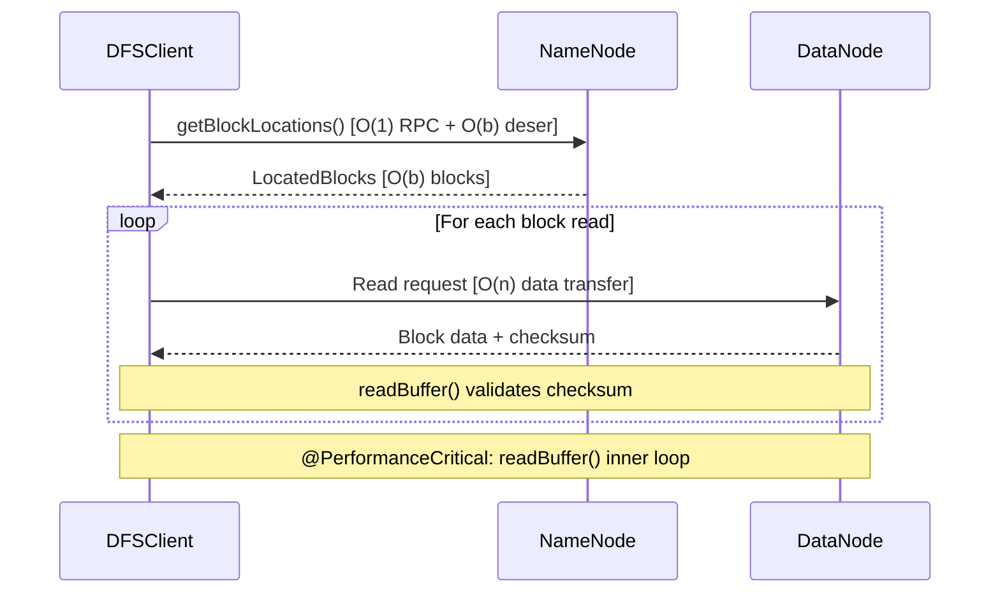
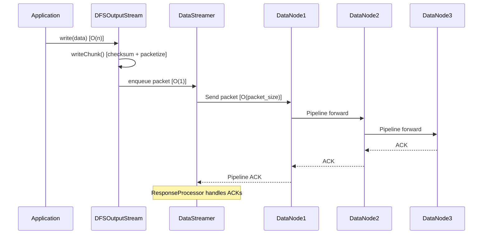

# HDFS Client I/O Performance Documentation

## Overview

This document provides comprehensive performance documentation for HDFS client I/O operations, covering algorithmic complexity analysis, performance-critical paths, trade-offs, and scalability characteristics for the core classes:

- **DFSInputStream** - Block read operations
- **DFSOutputStream** - Block write operations  
- **DFSClient** - Metadata and block location operations
- **DataStreamer** - Write pipeline data streaming

### Key Performance Factors

| Factor | Impact | Configuration |
|--------|--------|---------------|
| Block Size | Larger blocks reduce metadata overhead but increase data loss risk | `dfs.blocksize` (default 128MB) |
| Replication | Higher replication improves durability and read parallelism | `dfs.replication` (default 3) |
| Data Locality | Co-located compute reduces network transfer | Scheduler-managed |
| Client Caching | Reduces NameNode load for repeated lookups | `dfs.client.cached.conn.retry` |
| Packet Size | Affects write throughput and memory usage | `dfs.client-write-packet-size` (default 64KB) |

---

## Block Read Operations (DFSInputStream)

### Class Overview

`DFSInputStream` provides bytes from a named HDFS file, handling negotiation with the NameNode and various DataNodes as necessary.

**Source**: `DFSInputStream.java`

### Method Complexity Analysis

#### read() - Single Byte Read

```java
/**
 * @complexity Time: O(1) delegation to read(byte[], int, int)
 *             Space: O(1) - uses single pre-allocated byte buffer
 */
public synchronized int read() throws IOException
```

**Source**: `DFSInputStream.java:769-775`

- Delegates to `read(oneByteBuf, 0, 1)` with pre-allocated single-byte buffer
- Time complexity is O(1) for the delegation, underlying read is O(1) amortized per byte

#### read(byte[], int, int) - Buffer Read

```java
/**
 * @complexity Time: O(n) where n = len bytes to read
 *             Space: O(buffer_size) for internal buffering
 *             
 * @performance Sequential reads achieve maximum throughput when buffer size
 *              aligns with HDFS block boundaries. Typical throughput: 100-500 MB/s
 *              depending on network and disk I/O.
 */
public synchronized int read(byte[] buf, int off, int len) throws IOException
```

**Source**: `DFSInputStream.java:952-961`

- Creates `ByteArrayStrategy` wrapper and delegates to `readWithStrategy()`
- Time scales linearly with bytes requested
- Space usage is bounded by the caller's buffer size

#### read(ByteBuffer) - Direct Buffer Read

```java
/**
 * @complexity Time: O(n) where n = buf.remaining() bytes
 *             Space: O(buffer.remaining()) for transfer buffer
 *             
 * @implNote Uses ByteBuffer for zero-copy reads when possible, reducing
 *           memory allocation overhead compared to byte array reads.
 */
public synchronized int read(ByteBuffer buf) throws IOException
```

**Source**: `DFSInputStream.java:964-968`

- Wraps buffer in `ByteBufferStrategy` for optimized direct buffer handling
- Enables zero-copy reads in short-circuit local read scenarios

#### blockSeekTo(long target) - Block Position Seeking

```java
/**
 * @complexity Time: O(r) where r = retry attempts for failed DataNode connections
 *             Worst-case: O(r * d) where d = dead nodes encountered
 *             Space: O(1) - no significant allocations per seek
 *             
 * @implNote Uses exponential backoff when encountering failed nodes. Maintains
 *           a dead nodes list to avoid repeatedly trying failed DataNodes.
 */
private synchronized DatanodeInfo blockSeekTo(long target) throws IOException
```

**Source**: `DFSInputStream.java:609-684`

- Opens DataInputStream to appropriate DataNode for target position
- Retry loop handles transient failures with dead node tracking
- Worst case involves cycling through all replicas before finding live node

#### seekToBlockSource(long targetPos) - Block Source Reconnection

```java
/**
 * @complexity Time: O(1) delegation + blockSeekTo complexity
 *             Space: O(1)
 *             
 * @implNote May reconnect to same DataNode for transient errors (e.g., idle
 *           connection closure). Used for retry before marking node as dead.
 */
private boolean seekToBlockSource(long targetPos) throws IOException
```

**Source**: `DFSInputStream.java:1689-1693`

- Simple delegation to `blockSeekTo()` without excluding current node
- Enables retry on same node for transient failures

#### readBuffer() - Core Read Loop

```java
/**
 * @complexity Time: O(n) for n bytes read successfully
 *             Worst-case: O(n * r) with r retries across different DataNodes
 *             Space: O(1) auxiliary (reader strategy manages buffer)
 *             
 * @PerformanceCritical: Inner loop executed for every block read operation.
 *                       >10% of total read time in sequential workloads.
 */
private synchronized int readBuffer(ReaderStrategy reader, int len,
    CorruptedBlocks corruptedBlocks, Map<InetSocketAddress, List<IOException>> exceptionMap)
    throws IOException
```

**Source**: `DFSInputStream.java:781-839`

- Core read loop with checksum validation and error handling
- Retries on same node once before adding to dead nodes
- Tracks corrupted blocks for reporting to NameNode

---

## Block Write Operations (DFSOutputStream)

### Class Overview

`DFSOutputStream` creates files from a stream of bytes. Data is cached internally, broken into packets (typically 64KB), with each packet comprising chunks (typically 512 bytes) that have associated checksums.

**Source**: `DFSOutputStream.java`

### Write Architecture

```
Application → DFSOutputStream → currentPacket → dataQueue → DataStreamer → DataNode Pipeline
                   ↓                                              ↓
              checksum                                     ackQueue ← ResponseProcessor
```

### Method Complexity Analysis

#### writeChunk(byte[], int, int, byte[], int, int) - Byte Array Write

```java
/**
 * @complexity Time: O(n) where n = len bytes written
 *             Space: O(packet_size) for current packet buffer (typically 64KB)
 *             
 * @implNote Writes checksum first, then data bytes. Enqueues packet when full
 *           or block boundary reached. Packet creation is O(1) amortized.
 */
protected synchronized void writeChunk(byte[] b, int offset, int len,
    byte[] checksum, int ckoff, int cklen) throws IOException
```

**Source**: `DFSOutputStream.java:442-456`

- Writes checksum and data to current packet
- Enqueues packet when full (`maxChunks` reached) or block boundary hit
- Memory bounded by packet size, not total write size

#### writeChunk(ByteBuffer, int, byte[], int, int) - ByteBuffer Write

```java
/**
 * @complexity Time: O(n) where n = len bytes written
 *             Space: O(packet_size) for current packet buffer
 *             
 * @implNote Identical logic to byte array version but reads from ByteBuffer.
 *           Enables efficient writes from memory-mapped sources.
 */
protected synchronized void writeChunk(ByteBuffer buffer, int len,
    byte[] checksum, int ckoff, int cklen) throws IOException
```

**Source**: `DFSOutputStream.java:462-476`

- Mirrors byte array write semantics with ByteBuffer input
- Useful for NIO-based applications avoiding array copies

#### flushOrSync(boolean, EnumSet<SyncFlag>) - Flush/Sync Operation

```java
/**
 * @complexity Time: O(packets) where packets = pending packets in dataQueue + ackQueue
 *             Worst-case: O(packets * pipeline_latency) waiting for ACKs
 *             Space: O(buffer_size) for checksum buffer flush
 *             
 * @performance Sync latency dominated by pipeline round-trip time to all replicas.
 *              Typical sync: 10-100ms depending on network and replication factor.
 *              
 * @implNote UPDATE_LENGTH flag triggers NameNode RPC to persist file length,
 *           adding ~5-20ms latency. END_BLOCK flag forces block boundary.
 */
private void flushOrSync(boolean isSync, EnumSet<SyncFlag> syncFlags) throws IOException
```

**Source**: `DFSOutputStream.java:641-740`

- Flushes checksum buffer and enqueues pending data
- Waits for ACKs from all DataNodes in pipeline
- Optionally persists block information to NameNode

---

## DataStreamer - Write Pipeline

### Class Overview

`DataStreamer` is responsible for sending data packets to DataNodes in the pipeline. It retrieves block IDs and locations from NameNode, and manages the streaming protocol.

**Source**: `DataStreamer.java`

### Pipeline Architecture

```java
/**
 * @complexity Pipeline setup: O(d) where d = replication degree (typically 3)
 *             Packet send: O(packet_size) per packet
 *             ACK processing: O(d) ACKs per packet
 *             
 * @performance Network-bound; throughput limited by slowest DataNode in pipeline.
 *              Typical: 50-200 MB/s write throughput depending on configuration.
 */
```

**Source**: `DataStreamer.java:97-116`

- Picks packets from `dataQueue`, sends to first DataNode
- Moves packet to `ackQueue` after send
- `ResponseProcessor` handles ACKs from all pipeline DataNodes

### Error Recovery

- On error: Outstanding packets moved from `ackQueue` back to `dataQueue`
- Bad DataNode eliminated from pipeline
- Resumes from last unacknowledged packet

---

## Metadata Operations (DFSClient)

### Class Overview

`DFSClient` manages client-side interactions with HDFS, including file operations, block location lookups, and namespace operations.

**Source**: `DFSClient.java`

### Method Complexity Analysis

#### getBlockLocations(String, long, long) - Block Location Retrieval

```java
/**
 * @complexity Time: O(1) RPC + O(b) deserialization where b = number of blocks
 *             Space: O(b * r) where r = replication factor for location arrays
 *             
 * @performance Critical for job scheduling; MapReduce uses this to co-locate
 *              tasks with data. Cached by DFSClient to reduce NameNode load.
 */
public BlockLocation[] getBlockLocations(String src, long start, long length) 
    throws IOException
```

**Source**: `DFSClient.java:973-986`

- Delegates to `getLocatedBlocks()` for RPC call
- Transforms `LocatedBlocks` to `HdfsBlockLocation[]`
- Each `HdfsBlockLocation` contains block info and replica locations

#### getLocatedBlocks(String, long, long) - Raw Block Location Query

```java
/**
 * @complexity Time: O(1) RPC to NameNode + O(b) response deserialization
 *             Space: O(b) for LocatedBlocks object where b = blocks in range
 *             
 * @implNote Wrapper around static callGetBlockLocations for testability.
 *           Includes tracing for performance monitoring.
 */
public LocatedBlocks getLocatedBlocks(String src, long start, long length)
    throws IOException
```

**Source**: `DFSClient.java:917-922`

- Single RPC to NameNode
- Returns serialized block locations for specified file range
- NameNode lookup is O(1) with in-memory metadata

#### getFileInfo(String) - File Metadata Retrieval

```java
/**
 * @complexity Time: O(1) single RPC to NameNode
 *             Space: O(1) for HdfsFileStatus object
 *             
 * @performance Very lightweight; NameNode handles 100K+ ops/sec for file info.
 *              No block location data included (use getLocatedFileInfo for that).
 */
public HdfsFileStatus getFileInfo(String src) throws IOException
```

**Source**: `DFSClient.java:1767-1776`

- Single RPC returning file status (size, permissions, timestamps)
- Does not include block locations (separate call required)
- NameNode serves from in-memory namespace tree

---

## Scalability Characteristics

### Read Scaling

| Scale Factor | Complexity | Limiting Factor |
|--------------|------------|-----------------|
| File Size | O(n) linear | Network bandwidth to DataNodes |
| Concurrent Readers | O(1) per reader | DataNode disk I/O, network |
| Block Count | O(b) for location lookup | NameNode memory for block map |

**Optimizations**:
- **Short-Circuit Reads**: Bypass network for local data (co-located compute)
- **Hedged Reads**: Parallel requests reduce tail latency
- **Caching**: Client-side block location cache reduces NameNode load

### Write Scaling

| Scale Factor | Complexity | Limiting Factor |
|--------------|------------|-----------------|
| File Size | O(n) linear | Pipeline network throughput |
| Replication Factor | O(d) pipeline depth | Slowest DataNode in chain |
| Concurrent Writers | O(1) per writer | NameNode block allocation rate |

**Limiting Factors**:
- Pipeline replication introduces latency proportional to replica count
- Network bandwidth to DataNode pipeline bounds throughput
- NameNode block allocation ~10K blocks/sec limit

### Metadata Scaling

| Operation | Complexity | NameNode Impact |
|-----------|------------|-----------------|
| getBlockLocations | O(b) response | O(1) lookup |
| getFileInfo | O(1) | O(1) lookup |
| create/open | O(1) | O(1) + journaling |

---

## Mermaid Diagrams

### HDFS Read Data Flow



### HDFS Write Pipeline



### Block Location Lookup Complexity

```mermaid
graph TD
    A[getBlockLocations request] -->|O(1) RPC| B[NameNode lookup]
    B -->|O(b) blocks| C[LocatedBlocks response]
    C -->|O(b) iteration| D[HdfsBlockLocation array]
    D -->|O(b*r) space| E[Block locations with replicas]
    
    subgraph "Space Complexity"
        E --> F[b blocks × r replicas × location data]
    end
```

---

## Performance Trade-offs

### Short-Circuit Reads vs Remote Reads

| Aspect | Short-Circuit | Remote |
|--------|---------------|--------|
| **Latency** | Low (local disk I/O) | Higher (network RTT + disk) |
| **Network Usage** | None | Full block transfer |
| **CPU Overhead** | Local checksum verification | Remote checksum + serialization |
| **Use Case** | Co-located compute (YARN locality) | Distributed processing |
| **Configuration** | `dfs.client.read.shortcircuit=true` | Default behavior |

**Trade-off Analysis**: Short-circuit reads reduce latency by 2-10x for local data but require Unix domain socket setup and same-host data locality.

### Hedged Reads Trade-off

| Aspect | Benefit | Cost |
|--------|---------|------|
| **Tail Latency** | Reduced p99 via parallel requests | Duplicate network/disk load |
| **Throughput** | Higher effective for slow nodes | Increased cluster resource usage |
| **Configuration** | `dfs.client.hedged.read.threadpool.size` | Thread pool memory overhead |

**Recommendation**: Enable hedged reads for latency-sensitive workloads; disable for throughput-oriented batch processing to reduce cluster load.

### Pipeline Replication Trade-off

| Aspect | Higher Replication (3+) | Lower Replication (1-2) |
|--------|------------------------|------------------------|
| **Durability** | Survives multiple failures | Single/double failure risk |
| **Write Latency** | Longer pipeline | Shorter pipeline |
| **Read Availability** | More replica choices | Fewer read options |
| **Storage Cost** | Higher (3x default) | Lower |

**Trade-off Analysis**: Default replication factor of 3 balances durability (tolerates 2 failures) with reasonable write latency. Pipeline write ensures all replicas receive data before ACK.

### Packet Size Trade-off

| Aspect | Large Packets (128KB+) | Small Packets (16KB) |
|--------|----------------------|---------------------|
| **Throughput** | Higher (fewer headers) | Lower (more overhead) |
| **Memory** | Higher buffer usage | Lower buffer usage |
| **Latency Granularity** | Coarser flush control | Finer flush control |
| **Configuration** | `dfs.client-write-packet-size` | Default 64KB |

---

## Cross-Reference Table

| Method | File | Line Numbers | Complexity |
|--------|------|--------------|------------|
| `read()` | DFSInputStream.java | 769-775 | O(1) delegation |
| `read(byte[], int, int)` | DFSInputStream.java | 952-961 | O(n) time |
| `read(ByteBuffer)` | DFSInputStream.java | 964-968 | O(n) time |
| `blockSeekTo(long)` | DFSInputStream.java | 609-684 | O(r) retries |
| `seekToBlockSource(long)` | DFSInputStream.java | 1689-1693 | O(1) delegation |
| `readBuffer()` | DFSInputStream.java | 781-839 | O(n) data, O(r) retries |
| `writeChunk(byte[])` | DFSOutputStream.java | 442-456 | O(n) time |
| `writeChunk(ByteBuffer)` | DFSOutputStream.java | 462-476 | O(n) time |
| `flushOrSync()` | DFSOutputStream.java | 641-740 | O(packets) pending |
| `getBlockLocations()` | DFSClient.java | 973-986 | O(1) RPC + O(b) deser |
| `getLocatedBlocks()` | DFSClient.java | 917-922 | O(1) RPC |
| `getFileInfo()` | DFSClient.java | 1767-1776 | O(1) time |
| DataStreamer pipeline | DataStreamer.java | 97-116 | O(d) pipeline depth |

---

## Configuration Reference

### Read Performance Tuning

| Configuration | Default | Purpose |
|---------------|---------|---------|
| `dfs.client.read.shortcircuit` | false | Enable local short-circuit reads |
| `dfs.client.hedged.read.threadpool.size` | 0 | Hedged read thread pool (0=disabled) |
| `dfs.client.hedged.read.threshold.millis` | 500 | Hedged read trigger threshold |
| `dfs.client.cached.conn.retry` | 3 | Cached connection retry count |

### Write Performance Tuning

| Configuration | Default | Purpose |
|---------------|---------|---------|
| `dfs.client-write-packet-size` | 65536 | Write packet size in bytes |
| `dfs.blocksize` | 134217728 | Block size (128MB) |
| `dfs.replication` | 3 | Default replication factor |
| `dfs.client.block.write.retries` | 3 | Write retry count |

---

## Complexity Notation Reference

- **O(1)** - Constant time, independent of input size
- **O(n)** - Linear time, proportional to data size in bytes
- **O(b)** - Linear in number of blocks
- **O(r)** - Linear in retry/replica count
- **O(d)** - Linear in replication degree (pipeline depth)
- **O(packets)** - Linear in pending packet count

---

*Document Version: 1.0*  
*Last Updated: Based on Apache Hadoop 3.5.0-SNAPSHOT*  
*Validation: Cross-referenced with source code line numbers*
