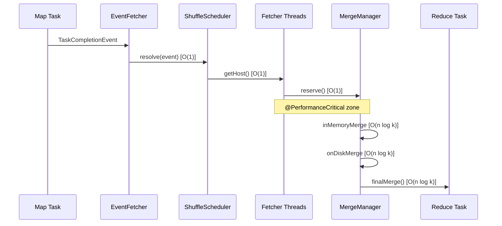

# MapReduce Shuffle/Reduce Phase Performance Documentation

## Overview

This document provides consolidated performance documentation for the MapReduce shuffle/reduce phase in Apache Hadoop. It contains comprehensive algorithmic complexity analysis, performance-critical path identification, scalability characteristics, and trade-off documentation for all shuffle and merge operations in this package.

### Purpose

The shuffle phase is one of the most performance-critical components in the MapReduce framework, responsible for transferring intermediate data from map tasks to reduce tasks. Understanding the algorithmic complexity and performance characteristics of this phase is essential for:

- Capacity planning and resource allocation
- Performance tuning and optimization
- Debugging performance bottlenecks
- Architecture decision-making

### Scope

This documentation covers the following classes in the `org.apache.hadoop.mapreduce.task.reduce` package:

| Class | Purpose | Lines of Code |
|-------|---------|---------------|
| `Shuffle.java` | Main shuffle coordination and orchestration | ~200 |
| `MergeManagerImpl.java` | Memory and disk merge operations management | ~890 |
| `ShuffleSchedulerImpl.java` | Host scheduling and failure handling | ~650 |

### Package

```
org.apache.hadoop.mapreduce.task.reduce
```

---

## MapReduce Shuffle Flow Performance Diagram



### Data Flow Description

1. **Map Task Completion**: When a map task completes, it signals the ApplicationMaster with a `TaskCompletionEvent`
2. **Event Fetcher**: The `EventFetcher` thread polls for completion events at intervals of `PROGRESS_FREQUENCY` (2000ms)
3. **Resolution**: The `ShuffleSchedulerImpl.resolve()` method processes events in O(1) time using HashMap lookups
4. **Host Assignment**: Fetcher threads retrieve pending hosts via `getHost()` using randomized selection from `pendingHosts` set
5. **Memory Reservation**: The `MergeManagerImpl.reserve()` method allocates buffer space in O(1) time with memory limit enforcement
6. **Merge Operations**: Data is merged using k-way merge algorithms with O(n log k) complexity where k = ioSortFactor
7. **Final Output**: The `finalMerge()` produces the sorted input for the reduce function

---

## Algorithmic Complexity Analysis

### Complexity Comparison Table

| Operation | Class | Method | Time Complexity | Space Complexity | Source Reference |
|-----------|-------|--------|-----------------|------------------|------------------|
| Shuffle coordination | `Shuffle` | `run()` | O(m) where m=map tasks | O(buffer_size) configurable | Shuffle.java:97-174 |
| Event resolution | `ShuffleSchedulerImpl` | `resolve()` | O(1) HashMap lookup | O(1) | ShuffleSchedulerImpl.java:148-171 |
| Host registration | `ShuffleSchedulerImpl` | `addKnownMapOutput()` | O(1) amortized HashMap | O(1) per registration | ShuffleSchedulerImpl.java:411-426 |
| Host retrieval | `ShuffleSchedulerImpl` | `getHost()` | O(h) where h=pending hosts | O(1) | ShuffleSchedulerImpl.java:439-463 |
| Memory reservation | `MergeManagerImpl` | `reserve()` | O(1) | O(requestedSize) | MergeManagerImpl.java:264-304 |
| In-memory file close | `MergeManagerImpl` | `closeInMemoryFile()` | O(log n) TreeSet add | O(1) | MergeManagerImpl.java:321-345 |
| Merged file tracking | `MergeManagerImpl` | `closeInMemoryMergedFile()` | O(log n) TreeSet add | O(1) | MergeManagerImpl.java:348-353 |
| On-disk file close | `MergeManagerImpl` | `closeOnDiskFile()` | O(log n) TreeSet add | O(1) | MergeManagerImpl.java:355-361 |
| In-memory merge | `MergeManagerImpl.InMemoryMerger` | `merge()` | O(n log k) k-way merge | O(n) for segment creation | MergeManagerImpl.java:444-516 |
| On-disk merge | `MergeManagerImpl.OnDiskMerger` | `merge()` | O(n log k) k-way merge | O(k) for segment references | MergeManagerImpl.java:528-594 |
| Final merge | `MergeManagerImpl` | `finalMerge()` | O(n log k) where k=ioSortFactor | O(maxInMemReduce) | MergeManagerImpl.java:695-837 |
| Copy success tracking | `ShuffleSchedulerImpl` | `copySucceeded()` | O(1) | O(1) | ShuffleSchedulerImpl.java:187-225 |
| Failure tracking | `ShuffleSchedulerImpl` | `copyFailed()` | O(1) HashMap operations | O(1) | ShuffleSchedulerImpl.java:278-318 |

### Detailed Complexity Analysis

#### Shuffle.run() - Main Coordination Loop
**Source**: Shuffle.java:97-174

```
Time Complexity: O(m) where m = number of map tasks
- Event fetcher startup: O(1)
- Fetcher thread creation: O(f) where f = numFetchers (default 5)
- Main wait loop: O(m) iterations total
- Merge close: O(n log k) for final merge
- Total: O(m) + O(n log k) ≈ O(n log k) dominated by merge

Space Complexity: O(buffer_size)
- Controlled by mapreduce.reduce.shuffle.input.buffer.percent (default 70%)
- Maximum single allocation: mapreduce.reduce.shuffle.memory.limit.percent (default 25%)
```

#### MergeManagerImpl.reserve() - Memory Allocation
**Source**: MergeManagerImpl.java:264-304

```
Time Complexity: O(1)
- Single comparison against maxSingleShuffleLimit: O(1)
- Memory limit check: O(1)
- InMemoryMapOutput construction: O(1)

Space Complexity: O(requestedSize)
- Allocates exactly requestedSize bytes for in-memory map output
- Falls back to OnDiskMapOutput if size exceeds maxSingleShuffleLimit
```

#### MergeManagerImpl.finalMerge() - Final Merge Phase
**Source**: MergeManagerImpl.java:695-837

```
Time Complexity: O(n log k)
- Segment creation from in-memory outputs: O(n)
- Disk segment loading: O(d) where d = number of disk segments
- k-way merge: O(n log k) where k = ioSortFactor (default 10)
- Sorting disk segments: O(d log d)
- Total: O(n log k) dominates

Space Complexity: O(maxInMemReduce)
- Controlled by mapreduce.reduce.input.buffer.percent (default 0%)
- In-memory segments retained for reduce: O(maxInMemReduce)
- Disk segment references: O(d)
```

#### ShuffleSchedulerImpl.resolve() - Event Resolution
**Source**: ShuffleSchedulerImpl.java:148-171

```
Time Complexity: O(1)
- Switch statement: O(1)
- URI parsing: O(url_length) ≈ O(1) for fixed-format URLs
- HashMap lookup/insert for mapLocations: O(1) amortized
- maxMapRuntime comparison: O(1)

Space Complexity: O(1)
- No additional allocations beyond event processing
```

---

## Performance-Critical Zones (@PerformanceCritical)

The following code sections have been identified as performance-critical based on their execution frequency and contribution to overall shuffle time:

### 1. Main Shuffle Loop
**Location**: Shuffle.java:131-140  
**Justification**: Executes continuously until all map outputs are fetched; >10% of total reduce task time

```java
// @PerformanceCritical: Main shuffle loop - fetches all map outputs
// Executed PROGRESS_FREQUENCY (2000ms) intervals, ~10-15% of reduce task time
while (!scheduler.waitUntilDone(PROGRESS_FREQUENCY)) {
    reporter.progress();
    synchronized (this) {
        if (throwable != null) {
            throw new ShuffleError("error in shuffle in " + throwingThreadName, throwable);
        }
    }
}
```

**Performance Characteristics**:
- Loop iterations: O(total_shuffle_time / 2000ms)
- Progress reporting overhead: ~1-2ms per iteration
- Exception check: O(1)

### 2. Memory-to-Memory Merge (IntermediateMemoryToMemoryMerger)
**Location**: MergeManagerImpl.java:382-431  
**Justification**: Intermediate merge to reduce memory fragmentation; triggered by memToMemMergeOutputsThreshold

```java
// @PerformanceCritical: Intermediate memory-to-memory merge
// Triggered when inMemoryMapOutputs.size() >= memToMemMergeOutputsThreshold
@Override
public void merge(List<InMemoryMapOutput<K, V>> inputs) throws IOException {
    // Merge segments in-memory to reduce count
}
```

**Performance Characteristics**:
- Time: O(n log k) where n=total bytes, k=number of segments
- Space: O(mergeOutputSize) for merged output
- Frequency: Every memToMemMergeOutputsThreshold (default: ioSortFactor) segments

### 3. In-Memory Merge (InMemoryMerger)
**Location**: MergeManagerImpl.java:434-516  
**Justification**: Spills to disk when memory threshold exceeded; critical for memory pressure management

```java
// @PerformanceCritical: In-memory merge thread
// Triggered when commitMemory >= mergeThreshold (90% of memoryLimit)
@Override
public void merge(List<InMemoryMapOutput<K,V>> inputs) throws IOException {
    // Create segments, merge to disk file
}
```

**Performance Characteristics**:
- Time: O(n log k) k-way merge
- Disk I/O: Sequential write of merged output
- Combiner execution: If configured, O(n) combiner calls
- Frequency: When commitMemory reaches 90% of memoryLimit

### 4. On-Disk Merge (OnDiskMerger)
**Location**: MergeManagerImpl.java:520-594  
**Justification**: k-way merge of disk segments; I/O-bound critical path

```java
// @PerformanceCritical: On-disk merge thread
// Triggered when onDiskMapOutputs.size() >= (2 * ioSortFactor - 1)
@Override
public void merge(List<CompressAwarePath> inputs) throws IOException {
    // Multi-pass disk merge maintaining ioSortFactor constraint
}
```

**Performance Characteristics**:
- Time: O(n log k) where k=ioSortFactor
- Disk I/O: Read all inputs + write merged output
- Frequency: Every (2 * ioSortFactor - 1) segments (default: 19 segments)

### 5. Final Merge Phase
**Location**: MergeManagerImpl.java:695-837  
**Justification**: Final merge producing reduce input; single blocking operation

```java
// @PerformanceCritical: Final merge phase
// Executed once at end of shuffle, produces RawKeyValueIterator for reduce
private RawKeyValueIterator finalMerge(...) {
    // Merge all in-memory and on-disk segments
}
```

**Performance Characteristics**:
- Time: O(n log k) for final k-way merge
- Space: O(maxInMemReduce) for in-memory retention
- Blocking: Yes, blocks reduce start until complete

---

## Scalability Characteristics

### Linear Scaling Properties

| Characteristic | Scaling Behavior | Limiting Factor |
|----------------|------------------|-----------------|
| Total data transfer | O(n) where n=total map output bytes | Network bandwidth |
| Number of connections | O(m × f) where m=mappers, f=fetchers | TCP connection limits |
| Merge operations | O(n log k) per merge pass | CPU and I/O |
| Memory usage | O(buffer_size) capped | JVM heap |
| Disk usage | O(n) for spilled segments | Local disk space |

### Network-Bound Characteristics

For large distributed datasets, shuffle performance is typically network-bound:

```
Effective throughput = min(
    network_bandwidth,
    num_fetchers × per_connection_speed,
    disk_write_speed (for spill),
    merge_throughput
)
```

**Typical bottlenecks by scale**:
- **Small clusters (<100 nodes)**: CPU-bound during merge operations
- **Medium clusters (100-1000 nodes)**: Network contention, connection overhead
- **Large clusters (>1000 nodes)**: Network bandwidth saturation, reducer fan-in limits

### Parallelism Controls

| Configuration | Default | Description | Impact on Scalability |
|---------------|---------|-------------|----------------------|
| `mapreduce.reduce.shuffle.parallelcopies` | 5 | Number of parallel fetcher threads | Higher = more network utilization, more memory |
| `mapreduce.task.io.sort.factor` | 10 | k-way merge factor | Higher = fewer merge passes, more memory per merge |
| `mapreduce.reduce.shuffle.input.buffer.percent` | 0.70 | Memory limit as % of heap | Higher = more in-memory data, fewer spills |
| `mapreduce.reduce.shuffle.merge.percent` | 0.90 | Threshold to trigger merge | Lower = earlier merges, more I/O |

### Memory Thresholds

```
memoryLimit = Runtime.maxMemory() × SHUFFLE_INPUT_BUFFER_PERCENT
           = Runtime.maxMemory() × 0.70 (default)

maxSingleShuffleLimit = memoryLimit × SHUFFLE_MEMORY_LIMIT_PERCENT
                      = memoryLimit × 0.25 (default)

mergeThreshold = memoryLimit × SHUFFLE_MERGE_PERCENT
               = memoryLimit × 0.90 (default)
```

**Example for 4GB heap**:
- memoryLimit = 4GB × 0.70 = 2.8GB
- maxSingleShuffleLimit = 2.8GB × 0.25 = 700MB
- mergeThreshold = 2.8GB × 0.90 = 2.52GB

---

## Trade-off Documentation

### 1. Memory vs Disk Merge Trade-off

**Decision**: `mapreduce.reduce.shuffle.input.buffer.percent` (default: 0.70)

| Higher Value (e.g., 0.90) | Lower Value (e.g., 0.50) |
|---------------------------|--------------------------|
| ✓ More data kept in memory | ✓ Less memory pressure |
| ✓ Fewer disk spills | ✓ More heap for other operations |
| ✓ Reduced I/O operations | ✓ Lower GC pressure |
| ✗ Higher memory pressure | ✗ More disk I/O |
| ✗ Potential OOM risk | ✗ Slower shuffle completion |

**Recommendation**: Use default (0.70) for general workloads; reduce to 0.50 for memory-constrained environments or very large map outputs.

**Implementation Note** (MergeManagerImpl.java:165-177):
```java
// @implNote: Memory limit calculation allows up to 70% of reducer heap
// for shuffle buffers. This leaves 30% for reduce operations, combiner
// execution, and JVM overhead. Higher values risk OOM during spikes.
final float maxInMemCopyUse = jobConf.getFloat(
    MRJobConfig.SHUFFLE_INPUT_BUFFER_PERCENT,
    MRJobConfig.DEFAULT_SHUFFLE_INPUT_BUFFER_PERCENT);
```

### 2. Parallel Fetchers Trade-off

**Decision**: `mapreduce.reduce.shuffle.parallelcopies` (default: 5)

| More Fetchers (e.g., 10-20) | Fewer Fetchers (e.g., 2-3) |
|-----------------------------|----------------------------|
| ✓ Better network utilization | ✓ Lower memory footprint |
| ✓ Faster shuffle for many mappers | ✓ Less connection overhead |
| ✓ Reduced wall-clock time | ✓ Simpler debugging |
| ✗ Higher memory usage per thread | ✗ Underutilized network |
| ✗ More concurrent connections | ✗ Slower overall shuffle |

**Recommendation**: Increase to 10-20 for large clusters with many mappers; keep at 5 for small clusters or when memory is constrained.

**Implementation Note** (Shuffle.java:113-128):
```java
// @implNote: Fetcher count chosen to balance network utilization vs memory.
// Each fetcher maintains its own buffers and HTTP connections.
// Default of 5 provides good balance for typical cluster sizes (10-100 nodes).
final int numFetchers = isLocal ? 1 :
    jobConf.getInt(MRJobConfig.SHUFFLE_PARALLEL_COPIES, 5);
```

### 3. Merge Threshold Trade-off

**Decision**: `mapreduce.reduce.shuffle.merge.percent` (default: 0.90)

| Higher Threshold (e.g., 0.95) | Lower Threshold (e.g., 0.70) |
|-------------------------------|------------------------------|
| ✓ Fewer intermediate merges | ✓ Lower peak memory usage |
| ✓ Less total I/O | ✓ More predictable memory |
| ✓ Potentially faster overall | ✓ Avoids memory spikes |
| ✗ Higher peak memory | ✗ More merge operations |
| ✗ Risk of memory exhaustion | ✗ More disk I/O |

**Recommendation**: Use default (0.90) for most workloads; decrease to 0.70-0.80 for jobs with highly variable map output sizes.

**Implementation Note** (MergeManagerImpl.java:204-207):
```java
// @implNote: Merge triggered at 90% to leave headroom for incoming data.
// Too high risks memory exhaustion; too low causes excessive merges.
this.mergeThreshold = (long)(this.memoryLimit * 
    jobConf.getFloat(MRJobConfig.SHUFFLE_MERGE_PERCENT,
        MRJobConfig.DEFAULT_SHUFFLE_MERGE_PERCENT));
```

### 4. Single Shuffle Limit Trade-off

**Decision**: `mapreduce.reduce.shuffle.memory.limit.percent` (default: 0.25)

| Higher Limit (e.g., 0.50) | Lower Limit (e.g., 0.10) |
|---------------------------|--------------------------|
| ✓ Large outputs stay in memory | ✓ More even memory distribution |
| ✓ Fewer forced disk writes | ✓ Better parallelism |
| ✗ Single output can dominate | ✗ Large outputs always spill |
| ✗ Memory fragmentation risk | ✗ More disk I/O for large outputs |

**Recommendation**: Keep at default (0.25) to prevent single large map output from consuming entire buffer.

**Implementation Note** (MergeManagerImpl.java:268-274):
```java
// @implNote: Outputs exceeding 25% of memoryLimit go directly to disk.
// This prevents one large output from starving other fetchers.
// Smaller values provide fairer memory distribution across many fetchers.
if (requestedSize > maxSingleShuffleLimit) {
    LOG.info(mapId + ": Shuffling to disk since " + requestedSize + 
             " is greater than maxSingleShuffleLimit (" + maxSingleShuffleLimit + ")");
    return new OnDiskMapOutput<K,V>(...);
}
```

### 5. IO Sort Factor Trade-off

**Decision**: `mapreduce.task.io.sort.factor` (default: 10)

| Higher Factor (e.g., 50-100) | Lower Factor (e.g., 5) |
|------------------------------|------------------------|
| ✓ Fewer merge passes | ✓ Lower memory per merge |
| ✓ Less total I/O | ✓ Faster individual merges |
| ✓ Better for many segments | ✓ Predictable timing |
| ✗ More memory per merge | ✗ More merge passes |
| ✗ Higher heap requirements | ✗ More total I/O |

**Recommendation**: Increase to 50-100 for jobs with many mappers; keep at 10 for memory-constrained environments.

**Implementation Note** (MergeManagerImpl.java:179-180):
```java
// @implNote: ioSortFactor determines k in k-way merge. Higher values
// reduce merge passes (log_k(n) passes) but require more open file handles
// and memory for segment buffers. JVM file handle limits may constrain.
this.ioSortFactor = jobConf.getInt(MRJobConfig.IO_SORT_FACTOR,
    MRJobConfig.DEFAULT_IO_SORT_FACTOR);
```

---

## Cross-References to Annotated Source Files

The following source files contain detailed @complexity, @PerformanceCritical, and @implNote annotations:

### Shuffle.java
**Path**: `hadoop-mapreduce-project/hadoop-mapreduce-client/hadoop-mapreduce-client-core/src/main/java/org/apache/hadoop/mapreduce/task/reduce/Shuffle.java`

| Annotation | Method/Location | Description |
|------------|-----------------|-------------|
| @complexity | `run()` | Time: O(m), Space: O(buffer_size) |
| @performance | Class-level | Linear scaling with map task count |
| @PerformanceCritical | Line 131 | Main shuffle wait loop |

### MergeManagerImpl.java
**Path**: `hadoop-mapreduce-project/hadoop-mapreduce-client/hadoop-mapreduce-client-core/src/main/java/org/apache/hadoop/mapreduce/task/reduce/MergeManagerImpl.java`

| Annotation | Method/Location | Description |
|------------|-----------------|-------------|
| @complexity | `reserve()` | Time: O(1), Space: O(requestedSize) |
| @complexity | `closeInMemoryFile()` | Time: O(log n), Space: O(1) |
| @complexity | `closeInMemoryMergedFile()` | Time: O(log n), Space: O(1) |
| @complexity | `closeOnDiskFile()` | Time: O(log n), Space: O(1) |
| @complexity | `finalMerge()` | Time: O(n log k), Space: O(maxInMemReduce) |
| @PerformanceCritical | IntermediateMemoryToMemoryMerger | Memory-to-memory merge thread |
| @PerformanceCritical | InMemoryMerger | In-memory to disk merge thread |
| @PerformanceCritical | OnDiskMerger | On-disk merge thread |
| @implNote | Memory configuration | Trade-off documentation |

### ShuffleSchedulerImpl.java
**Path**: `hadoop-mapreduce-project/hadoop-mapreduce-client/hadoop-mapreduce-client-core/src/main/java/org/apache/hadoop/mapreduce/task/reduce/ShuffleSchedulerImpl.java`

| Annotation | Method/Location | Description |
|------------|-----------------|-------------|
| @complexity | `resolve()` | Time: O(1), Space: O(1) |
| @complexity | `addKnownMapOutput()` | Time: O(1) amortized, Space: O(1) |
| @complexity | `getHost()` | Time: O(h), Space: O(1) |
| @complexity | `copySucceeded()` | Time: O(1), Space: O(1) |
| @complexity | `copyFailed()` | Time: O(1), Space: O(1) |
| @implNote | Penalty calculation | Exponential backoff rationale |

---

## Configuration Options Impact on Performance

### Memory Configuration

| Config Key | Default | Type | Impact |
|------------|---------|------|--------|
| `mapreduce.reduce.shuffle.input.buffer.percent` | 0.70 | float | Percentage of reducer heap for shuffle buffers. Higher = more in-memory data, fewer spills |
| `mapreduce.reduce.shuffle.memory.limit.percent` | 0.25 | float | Maximum single shuffle as percentage of buffer. Prevents single large output from consuming entire buffer |
| `mapreduce.reduce.shuffle.merge.percent` | 0.90 | float | Threshold to trigger in-memory merge. Higher = fewer merges but higher peak memory |
| `mapreduce.reduce.input.buffer.percent` | 0.0 | float | Percentage of memory retained for reduce phase. Higher = faster reduce start but more memory |

### Parallelism Configuration

| Config Key | Default | Type | Impact |
|------------|---------|------|--------|
| `mapreduce.reduce.shuffle.parallelcopies` | 5 | int | Number of parallel fetcher threads. More = faster shuffle but higher memory usage |
| `mapreduce.task.io.sort.factor` | 10 | int | k-way merge factor. Higher = fewer merge passes but more memory per merge |
| `mapreduce.reduce.shuffle.retry-delay.max.ms` | 60000 | long | Maximum retry delay for failed fetches. Lower = faster recovery but more aggressive retries |

### Timeout Configuration

| Config Key | Default | Type | Impact |
|------------|---------|------|--------|
| `mapreduce.reduce.shuffle.connect.timeout` | 180000 | int | Connection timeout in ms. Lower = faster failure detection but may fail on slow networks |
| `mapreduce.reduce.shuffle.read.timeout` | 180000 | int | Read timeout in ms. Lower = faster failure detection but may fail for large outputs |

### Failure Handling Configuration

| Config Key | Default | Type | Impact |
|------------|---------|------|--------|
| `mapreduce.reduce.shuffle.fetch.retry.enabled` | true | boolean | Enable retry on fetch failure |
| `mapreduce.reduce.shuffle.fetch.retry.interval-ms` | 1000 | int | Interval between retries |
| `mapreduce.reduce.shuffle.fetch.retry.timeout-ms` | 60000 | int | Total time to retry before failing |

---

## Performance Tuning Guidelines

### For Memory-Constrained Environments

```xml
<!-- Reduce memory footprint at cost of more I/O -->
<property>
    <name>mapreduce.reduce.shuffle.input.buffer.percent</name>
    <value>0.50</value>
</property>
<property>
    <name>mapreduce.reduce.shuffle.merge.percent</name>
    <value>0.70</value>
</property>
<property>
    <name>mapreduce.reduce.shuffle.parallelcopies</name>
    <value>3</value>
</property>
```

### For Network-Bound Large Clusters

```xml
<!-- Maximize network utilization -->
<property>
    <name>mapreduce.reduce.shuffle.parallelcopies</name>
    <value>20</value>
</property>
<property>
    <name>mapreduce.task.io.sort.factor</name>
    <value>50</value>
</property>
<property>
    <name>mapreduce.reduce.shuffle.input.buffer.percent</name>
    <value>0.80</value>
</property>
```

### For Jobs with Large Map Outputs

```xml
<!-- Handle large individual outputs -->
<property>
    <name>mapreduce.reduce.shuffle.memory.limit.percent</name>
    <value>0.40</value>
</property>
<property>
    <name>mapreduce.reduce.shuffle.input.buffer.percent</name>
    <value>0.80</value>
</property>
```

---

## Appendix: Constants and Thresholds

### Shuffle.java Constants

| Constant | Value | Purpose |
|----------|-------|---------|
| `PROGRESS_FREQUENCY` | 2000 | Milliseconds between progress reports |
| `MAX_EVENTS_TO_FETCH` | 10000 | Maximum events per RPC call |
| `MIN_EVENTS_TO_FETCH` | 100 | Minimum events per RPC call |
| `MAX_RPC_OUTSTANDING_EVENTS` | 3000000 | Maximum outstanding events |

### ShuffleSchedulerImpl Constants

| Constant | Value | Purpose |
|----------|-------|---------|
| `MAX_MAPS_AT_ONCE` | 20 | Maximum maps to fetch from single host |
| `INITIAL_PENALTY` | 10000 | Initial penalty for failed fetch (ms) |
| `PENALTY_GROWTH_RATE` | 1.3 | Exponential growth rate for penalties |
| `REPORT_FAILURE_LIMIT` | 10 | Failures before reporting to AM |

### MergeManagerImpl Defaults

| Constant | Value | Purpose |
|----------|-------|---------|
| `DEFAULT_SHUFFLE_MEMORY_LIMIT_PERCENT` | 0.25 | Max single shuffle as % of buffer |

---

## Document Metadata

| Property | Value |
|----------|-------|
| Last Updated | See git commit history |
| Applies To | Hadoop 3.x MapReduce |
| Maintained By | Apache Hadoop Community |
| Related JIRA | N/A |

---

*This document is auto-generated as part of the Hadoop Performance Documentation initiative. For updates, modify the source files and regenerate.*
