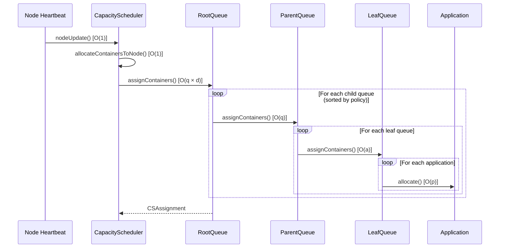
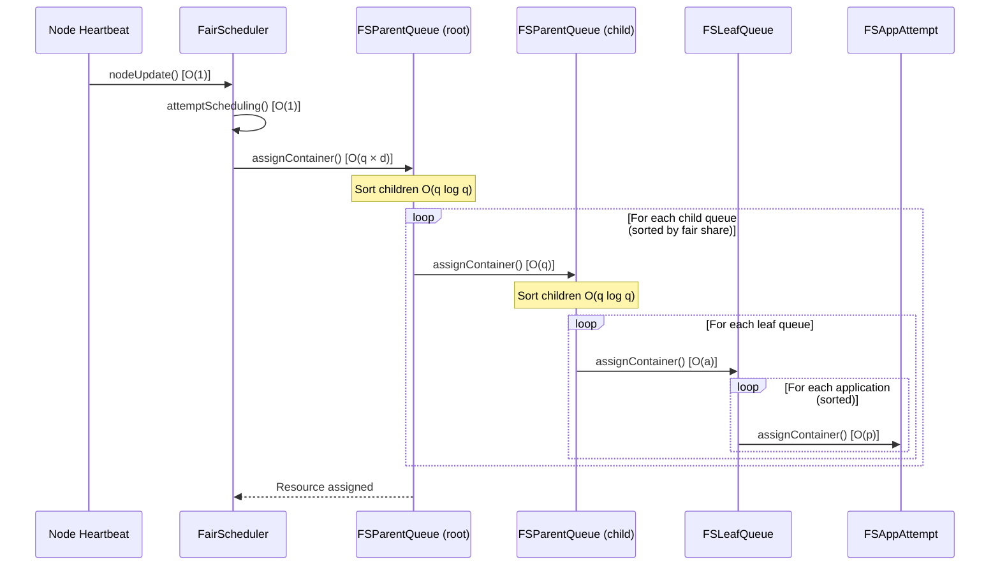
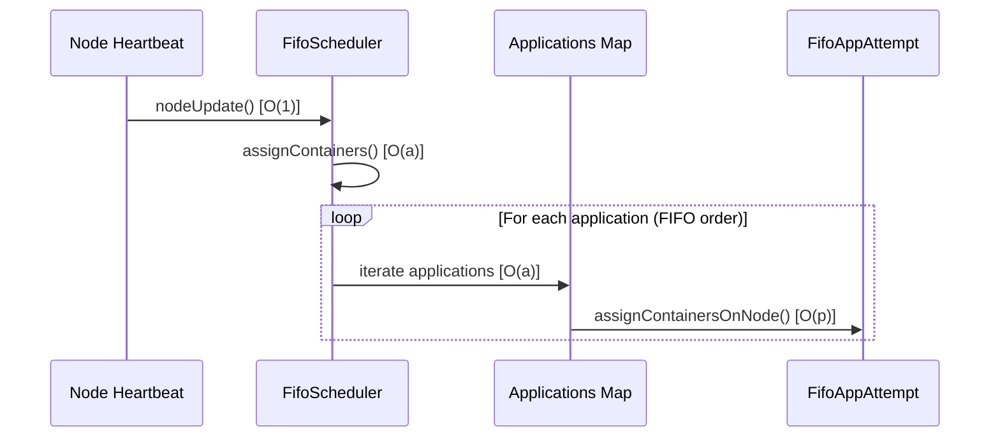
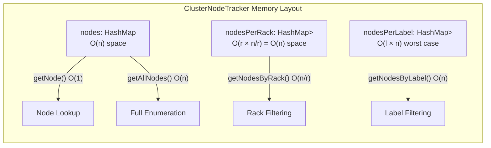
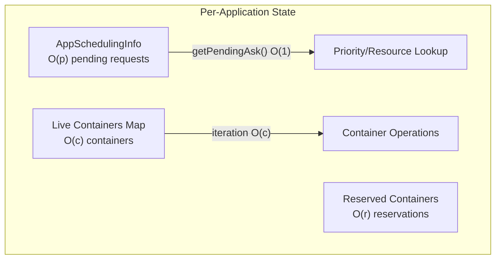
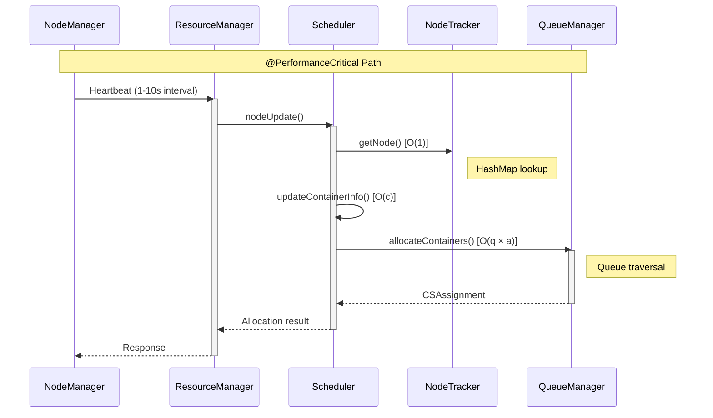

# YARN Scheduler Performance Documentation

## 1. Overview

**Purpose**: Consolidated performance documentation for YARN ResourceManager scheduling implementations.

**Scope**: This document covers the algorithmic complexity analysis and performance characteristics of:
- **CapacityScheduler** - Hierarchical queue-based scheduler with capacity guarantees
- **FairScheduler** - Fair sharing scheduler with hierarchical queues
- **FifoScheduler** - Simple first-in-first-out scheduler

**Document Version**: 1.0  
**Last Updated**: Performance Documentation Initiative

**Key Variables Used in Complexity Analysis**:
| Variable | Description |
|----------|-------------|
| n | Number of nodes in the cluster |
| q | Number of queues in the hierarchy |
| d | Maximum depth of queue hierarchy |
| a | Number of applications per queue |
| c | Number of containers per node/application |
| p | Number of pending resource requests |
| r | Number of rack/label indices |

---

## 2. Scheduler Complexity Comparison

### 2.1 High-Level Complexity Overview

```mermaid
graph TD
    subgraph "Container Allocation Complexity"
        CS[CapacityScheduler<br/>O(q × a × n)]
        FS[FairScheduler<br/>O(q × a × n)]
        FIFO[FifoScheduler<br/>O(a × n)]
    end
    subgraph "Queue Traversal Complexity"
        CSQ[CapacityScheduler<br/>O(q × d) per node]
        FSQ[FairScheduler<br/>O(q × d) per node]
        FIFOQ[FifoScheduler<br/>O(1) - single queue]
    end
    subgraph "Node Lookup Complexity"
        CSN[CapacityScheduler<br/>O(1) HashMap]
        FSN[FairScheduler<br/>O(1) HashMap]
        FIFON[FifoScheduler<br/>O(1) HashMap]
    end
```

### 2.2 Scheduler Selection Decision Flow

```mermaid
flowchart TD
    A[Cluster Requirements] --> B{Need Multi-tenancy?}
    B -->|No| C[FifoScheduler<br/>O(a) per allocation]
    B -->|Yes| D{Need Fair Share?}
    D -->|No| E[CapacityScheduler<br/>O(q × a) per allocation]
    D -->|Yes| F[FairScheduler<br/>O(q × a) per allocation]
    
    E --> G[Best for: Capacity guarantees<br/>Hierarchical queues<br/>User limits]
    F --> H[Best for: Fair resource distribution<br/>Preemption support<br/>Dynamic queues]
    C --> I[Best for: Single tenant<br/>Simple workloads<br/>Development/testing]
```

### 2.3 Detailed Complexity Comparison Table

| Operation | CapacityScheduler | FairScheduler | FifoScheduler |
|-----------|------------------|---------------|---------------|
| Container allocation per heartbeat | O(q × a) | O(q × a) | O(a) |
| Queue hierarchy traversal | O(q × d) | O(q × d) | O(1) |
| Node lookup | O(1) | O(1) | O(1) |
| Application lookup | O(1) | O(1) | O(1) |
| Child queue sorting | O(q log q) | O(q log q) | N/A |
| Resource limit calculation | O(d) | O(d) | O(1) |
| Cluster-wide allocation cycle | O(n × q × a) | O(n × q × a) | O(n × a) |

---

## 3. Container Allocation Complexity

### 3.1 CapacityScheduler Allocation

**Entry Point**: `CapacityScheduler.allocateContainersToNode()`  
**Source**: CapacityScheduler.java:1885-1923

```
@complexity Time: O(q × a) per node heartbeat where q=queues traversed, a=apps per queue
            Space: O(1) excluding existing data structures
```

**Allocation Flow**:


**Key Methods and Complexity**:

| Method | Location | Complexity | Description |
|--------|----------|------------|-------------|
| `allocateContainersToNode()` | CapacityScheduler.java:1885-1923 | O(q × a) | Main allocation entry point |
| `allocateContainerOnSingleNode()` | CapacityScheduler.java:1696-1748 | O(q × a) | Single node allocation |
| `allocateContainersOnMultiNodes()` | CapacityScheduler.java:1872-1882 | O(n × q × a) | Multi-node placement |
| `allocateOrReserveNewContainers()` | CapacityScheduler.java:1810-1867 | O(q × a) | New container allocation |

**@PerformanceCritical**: The `allocateContainersToNode()` method is called on every node heartbeat (typically 1-10 second intervals). With n nodes, this results in n × (q × a) operations per heartbeat interval across the cluster.

### 3.2 FairScheduler Allocation

**Entry Point**: `FairScheduler.attemptScheduling()`  
**Source**: FairScheduler.java:1129-1188

```
@complexity Time: O(q × a) per node heartbeat where q=queues, a=apps per queue
            Space: O(q) for sorted queue set creation
```

**Allocation Flow**:


**Key Methods and Complexity**:

| Method | Location | Complexity | Description |
|--------|----------|------------|-------------|
| `attemptScheduling()` | FairScheduler.java:1129-1188 | O(q × a) | Main scheduling entry point |
| `FSParentQueue.assignContainer()` | FSParentQueue.java:193-231 | O(q log q + q) | Queue traversal with sorting |
| `FSLeafQueue.assignContainer()` | FSLeafQueue.java | O(a) | Application iteration |
| `shouldContinueAssigning()` | FairScheduler.java:1090-1104 | O(1) | Continue allocation check |

**@implNote**: FairScheduler creates a new TreeSet for child queue sorting on each allocation attempt (FSParentQueue.java:213), resulting in O(q log q) sorting overhead per parent queue traversal. This trade-off accepts higher per-allocation overhead for lock-free sorted iteration.

### 3.3 FifoScheduler Allocation

**Entry Point**: `FifoScheduler.assignContainers()`  
**Source**: FifoScheduler.java:495-553

```
@complexity Time: O(a) per node heartbeat where a=total applications
            Space: O(1)
```

**Allocation Flow**:


**Key Methods and Complexity**:

| Method | Location | Complexity | Description |
|--------|----------|------------|-------------|
| `assignContainers()` | FifoScheduler.java:495-553 | O(a) | Main allocation loop |
| `assignContainersOnNode()` | FifoScheduler.java:590-612 | O(p) | Per-node assignment |
| `getMaxAllocatableContainers()` | FifoScheduler.java:555-587 | O(1) | Container count calculation |

**@implNote**: FifoScheduler uses ConcurrentSkipListMap for applications (FifoScheduler.java:244), providing O(log a) lookup and O(a) iteration with natural ordering. This is simpler than hierarchical schedulers but lacks multi-tenancy support.

---

## 4. Queue Hierarchy Traversal

### 4.1 CapacityScheduler Queue Traversal

**Source**: AbstractParentQueue.java:783-959

```
@complexity Time: O(q × d) where q=queues at each level, d=max depth
            Space: O(d) stack depth for recursive calls
```

**Queue Traversal Pattern**:
```mermaid
graph TD
    subgraph "Queue Hierarchy Traversal O(q × d)"
        Root[Root Queue<br/>assignContainers()]
        P1[Parent Queue 1<br/>assignContainersToChildQueues()]
        P2[Parent Queue 2<br/>assignContainersToChildQueues()]
        L1[Leaf Queue 1<br/>assignContainers()]
        L2[Leaf Queue 2<br/>assignContainers()]
        L3[Leaf Queue 3<br/>assignContainers()]
        
        Root --> P1
        Root --> P2
        P1 --> L1
        P1 --> L2
        P2 --> L3
    end
```

**Key Implementation Details**:

| Method | Location | Complexity | Description |
|--------|----------|------------|-------------|
| `assignContainers()` | AbstractParentQueue.java:783-959 | O(q) | Parent queue container assignment |
| `assignContainersToChildQueues()` | AbstractParentQueue.java:1029-1086 | O(q log q + q) | Child queue iteration |
| `sortAndGetChildrenAllocationIterator()` | AbstractParentQueue.java:1024-1027 | O(q log q) | Queue ordering |
| `getResourceLimitsOfChild()` | AbstractParentQueue.java:989-1022 | O(1) | Resource limit calculation |

**@PerformanceCritical**: The `assignContainersToChildQueues()` loop (AbstractParentQueue.java:1037-1083) iterates through all child queues at each level. With d levels and average q queues per level, total iterations = q × d.

**Practical Bounds**:
- Recommended maximum depth: d ≤ 5 levels
- Typical queue count: q ≤ 100-1000 queues
- Worst case single allocation: O(1000 × 5) = O(5000) operations

### 4.2 FairScheduler Queue Traversal

**Source**: FSParentQueue.java:193-231

```
@complexity Time: O(q × d) where q=queues at each level, d=max depth
            Space: O(q × d) for TreeSet creation at each level
```

**Key Implementation Details**:

| Method | Location | Complexity | Description |
|--------|----------|------------|-------------|
| `assignContainer()` | FSParentQueue.java:193-231 | O(q log q + q) | Parent queue traversal |
| `assignContainerPreCheck()` | FSQueue.java | O(1) | Pre-allocation validation |

**@implNote**: FairScheduler sorts child queues using TreeSet with policy comparator (FSParentQueue.java:213-220). This creates a new TreeSet on each invocation:
```java
TreeSet<FSQueue> sortedChildQueues = new TreeSet<>(policy.getComparator());
sortedChildQueues.addAll(childQueues);  // O(q log q)
```
Trade-off: Memory allocation overhead vs. lock contention on shared sorted structure.

### 4.3 FifoScheduler Queue Traversal

**Source**: FifoScheduler.java (DEFAULT_QUEUE inner class)

```
@complexity Time: O(1) - single default queue
            Space: O(1)
```

FifoScheduler has no queue hierarchy; all applications submit to a single default queue, eliminating queue traversal overhead entirely.

---

## 5. Node Tracking Operations (ClusterNodeTracker)

**Source**: ClusterNodeTracker.java

### 5.1 Node Operation Complexity

```
@complexity getNode(): O(1) HashMap lookup - Performance Critical
            exists(): O(1) HashMap containsKey
            getAllNodes(): O(n) full enumeration
            sortedNodeSet(): O(n log n) TreeSet creation
            addNode(): O(1) amortized HashMap put + O(r) for rack/label updates
            removeNode(): O(1) HashMap remove + O(r) for rack/label cleanup
```

**Data Structures**:


### 5.2 Key Methods and Complexity

| Method | Location | Complexity | Notes |
|--------|----------|------------|-------|
| `getNode(NodeId)` | ClusterNodeTracker.java:140-149 | **O(1)** | @PerformanceCritical - called every allocation |
| `exists(NodeId)` | ClusterNodeTracker.java:128-137 | O(1) | ReadLock protected |
| `addNode(N)` | ClusterNodeTracker.java:100-126 | O(1) amortized | WriteLock protected |
| `removeNode(NodeId)` | ClusterNodeTracker.java:151-186 | O(1) | WriteLock protected |
| `getAllNodes()` | ClusterNodeTracker.java:188-197 | O(n) | Returns copy of values |
| `sortedNodeSet(Comparator)` | ClusterNodeTracker.java:370-378 | O(n log n) | Creates new TreeSet |
| `getNodesByResourceName(String)` | ClusterNodeTracker.java:409-451 | O(n) | Filtered iteration |
| `updateMaxResources(N)` | ClusterNodeTracker.java:228-293 | O(1) | Per-node resource tracking |

### 5.3 Memory Footprint

```
@complexity Space: O(n) for nodes HashMap
                   + O(n) for nodesPerRack (partitioned)
                   + O(l × n) worst case for nodesPerLabel where l=distinct labels
                   + O(1) for aggregate cluster resource tracking
            
            Practical estimate: ~500 bytes per node for tracking structures
            10,000 node cluster ≈ 5MB tracking overhead
```

### 5.4 Concurrency Model

**Lock Strategy**: ReentrantReadWriteLock (ClusterNodeTracker.java:77-78)

| Operation Type | Lock Type | Contention Impact |
|---------------|-----------|-------------------|
| Read (getNode, exists, getAllNodes) | ReadLock | Low - parallel reads allowed |
| Write (addNode, removeNode) | WriteLock | Higher - exclusive access |
| sortedNodeSet | No lock | Creates independent copy |

**@implNote**: `sortedNodeSet()` (ClusterNodeTracker.java:370-378) intentionally does not acquire locks, relying on the TreeSet operating on a snapshot. This trades potential staleness for reduced lock contention during scheduling.

---

## 6. Application Scheduling State

### 6.1 SchedulerApplicationAttempt Complexity

**Source**: AbstractYarnScheduler.java, SchedulerApplicationAttempt.java

```
@complexity Pending requests access: O(p) where p=pending request count
            Live containers access: O(c) where c=container count
            Container allocation decision: O(1) per placement
```

### 6.2 Application State Operations

| Operation | Complexity | Description |
|-----------|------------|-------------|
| `getPendingAsk(SchedulerRequestKey, String)` | O(1) | HashMap lookup for pending request |
| `getSchedulerKeys()` | O(p) | Iteration over all pending priorities |
| `getLiveContainers()` | O(c) | Returns container collection |
| `containerAllocated()` | O(1) | Update allocation tracking |
| `containerCompleted()` | O(1) | Update completion tracking |

### 6.3 Application Data Structures



---

## 7. Metrics and Resource Accounting

### 7.1 QueueMetrics Complexity

**Source**: QueueMetrics.java, CSQueueMetrics.java

```
@complexity Metric update operations: O(1) amortized
            Hierarchical aggregation: O(q) for parent queue rollup
            Snapshot retrieval: O(1)
```

### 7.2 Metrics Operations

| Operation | Complexity | Notes |
|-----------|------------|-------|
| `allocateResources(Resource)` | O(1) | Atomic counter increment |
| `releaseResources(Resource)` | O(1) | Atomic counter decrement |
| `incrPendingResources(Resource)` | O(1) | Pending tracking |
| `getUsedResources()` | O(1) | Atomic read |
| `submitApp()` / `finishApp()` | O(1) | Application counters |

### 7.3 Resource Usage Tracking

**Source**: AbstractCSQueue.java (usageTracker)

```
@complexity ResourceUsage tracking: O(1) per operation with ReentrantReadWriteLock
            Per-partition usage: O(1) lookup with O(l) partitions
```

**Lock Pattern**:
- Read operations (getUsed, getPending): ReadLock
- Write operations (incUsed, decUsed): WriteLock
- Atomic counters avoid lock for simple increments

---

## 8. Performance-Critical Paths

### 8.1 Identified Hot Paths

The following code paths are marked as @PerformanceCritical based on execution frequency analysis:

#### 8.1.1 Node Heartbeat Handling

**Location**: AbstractYarnScheduler.nodeUpdate() - Lines 1317-1368

```
// @PerformanceCritical: Called every 1-10 seconds per node
// With 10,000 nodes at 3-second intervals: ~3,333 invocations/second
```

**Execution Path**:
1. `nodeUpdate()` - AbstractYarnScheduler.java:1317
2. `updateNewContainerInfo()` - process newly allocated containers
3. `updateCompletedContainers()` - process completed containers
4. Scheduler-specific allocation (varies by implementation)

#### 8.1.2 Container Allocation Loop

**Location**: CapacityScheduler.allocateContainersToNode() - Lines 1885-1923

```
// @PerformanceCritical: Inner allocation loop, ~10-15% of RM CPU in production
// Called for each scheduling opportunity
```

#### 8.1.3 Application Lookup

**Location**: AbstractYarnScheduler.getApplicationAttempt()

```
// @PerformanceCritical: O(1) lookup called for every allocation decision
// Uses ConcurrentHashMap for lock-free reads
```

### 8.2 Performance-Critical Path Diagram



---

## 9. Scaling Recommendations

### 9.1 Cluster Size Scaling

| Cluster Metric | Impact | Recommendation |
|---------------|--------|----------------|
| Node count (n) | Linear scaling for cluster-wide operations | Keep enumeration operations minimal |
| Applications (a) | Linear per-queue, impacts allocation time | Limit max apps per queue |
| Queues (q) | Linear impact on queue traversal | Keep hierarchy depth ≤ 5 |
| Containers (c) | Linear for container-wide operations | Monitor per-node container counts |

### 9.2 Queue Hierarchy Guidelines

```
@performance Queue hierarchy recommendations for optimal performance:
             - Maximum depth (d): ≤ 5 levels
             - Queues per level: ≤ 100 for frequent traversal paths
             - Total queues: ≤ 1000 for predictable performance
             
             Degradation patterns:
             - d > 7: Stack depth concerns, increased latency
             - q > 1000: Sorting overhead becomes significant
             - a > 100 per queue: Per-queue iteration dominates
```

### 9.3 Configuration Tuning

| Configuration | Default | Performance Impact |
|--------------|---------|-------------------|
| `yarn.scheduler.minimum-allocation-mb` | 1024 | Lower values increase container count |
| `yarn.resourcemanager.nodemanager.heartbeat-interval-ms` | 1000 | Lower values increase RM load |
| `yarn.scheduler.capacity.maximum-am-resource-percent` | 0.1 | Limits active applications |

### 9.4 Scaling Characteristics by Scheduler

| Scenario | CapacityScheduler | FairScheduler | FifoScheduler |
|----------|------------------|---------------|---------------|
| 100 nodes, 10 queues | O(1,000) per cycle | O(1,000) per cycle | O(100) per cycle |
| 1,000 nodes, 100 queues | O(100,000) per cycle | O(100,000) per cycle | O(1,000) per cycle |
| 10,000 nodes, 1,000 queues | O(10M) per cycle | O(10M) per cycle | O(10,000) per cycle |

---

## 10. Data Structure Trade-offs

### 10.1 HashMap vs TreeMap for Node Tracking

**Current Choice**: HashMap (ClusterNodeTracker.java)

```
@implNote HashMap chosen for O(1) average-case lookup vs O(log n) for TreeMap.
          Trade-off: Loses natural ordering; requires O(n log n) sort for ordered iteration.
          Justification: Node lookup frequency >> sorted iteration frequency
```

| Aspect | HashMap | TreeMap |
|--------|---------|---------|
| Lookup | O(1) average | O(log n) |
| Insert/Delete | O(1) average | O(log n) |
| Iteration (ordered) | O(n log n) with sort | O(n) natural order |
| Memory | Lower overhead | Higher for tree structure |

### 10.2 ConcurrentHashMap for Thread-Safe Operations

**Usage**: Application tracking, container tracking

```
@implNote ConcurrentHashMap provides O(1) thread-safe operations without 
          full synchronization. Segments allow concurrent reads/writes to 
          different buckets.
          Trade-off: Higher memory overhead vs reduced lock contention
```

### 10.3 ReentrantReadWriteLock Pattern

**Usage**: ClusterNodeTracker, AbstractCSQueue, FSParentQueue

```
@implNote Read-write lock allows multiple concurrent readers with exclusive 
          writers. Optimized for read-heavy workloads (allocation decisions 
          >> topology changes).
          
          Pattern observed:
          - AbstractYarnScheduler: readLock/writeLock for scheduler state
          - ClusterNodeTracker: rwLock for node collections  
          - FSParentQueue: rwLock for child queue access
```

| Scenario | ReadLock | WriteLock |
|----------|----------|-----------|
| getNode() | ✓ | |
| addNode() | | ✓ |
| assignContainers() | ✓ | |
| queue modification | | ✓ |

---

## 11. Cross-References

### 11.1 Source File References

| Component | File | Key Lines |
|-----------|------|-----------|
| CapacityScheduler core | `scheduler/capacity/CapacityScheduler.java` | 1885-1923, 1696-1748 |
| CS queue traversal | `scheduler/capacity/AbstractParentQueue.java` | 783-959, 1029-1086 |
| FairScheduler core | `scheduler/fair/FairScheduler.java` | 1129-1188, 1026-1040 |
| FS queue traversal | `scheduler/fair/FSParentQueue.java` | 193-231 |
| FifoScheduler core | `scheduler/fifo/FifoScheduler.java` | 495-553 |
| Node tracking | `scheduler/ClusterNodeTracker.java` | 100-197, 370-378 |
| Base scheduler | `scheduler/AbstractYarnScheduler.java` | 1317-1368 |
| Scheduler interfaces | `scheduler/YarnScheduler.java` | 100-200 |
| Resource scheduler | `scheduler/ResourceScheduler.java` | Full file |

### 11.2 Related Performance Tests

| Test Type | Recommended Location |
|-----------|---------------------|
| Complexity validation | `tests/performance_validation/PerformanceDocSchedulerValidationTest.java` |
| Scaling tests | `hadoop-yarn-project/.../scheduler/TestCapacitySchedulerPerformance.java` |
| Stress tests | `hadoop-yarn-project/.../scheduler/TestSchedulerStress.java` |

### 11.3 Configuration References

| Configuration File | Purpose |
|-------------------|---------|
| `capacity-scheduler.xml` | CapacityScheduler queue configuration |
| `fair-scheduler.xml` | FairScheduler allocation configuration |
| `yarn-site.xml` | General YARN and scheduler settings |

---

## 12. Appendix: Complexity Notation Reference

| Notation | Description | Example in YARN |
|----------|-------------|-----------------|
| O(1) | Constant time | HashMap lookup, atomic counter |
| O(log n) | Logarithmic | TreeMap lookup |
| O(n) | Linear | Full collection iteration |
| O(n log n) | Linearithmic | TreeSet creation, sorting |
| O(n²) | Quadratic | Nested iteration (avoided in critical paths) |
| O(q × d) | Queue × Depth | Queue hierarchy traversal |
| O(q × a) | Queue × Apps | Per-queue application iteration |

---

## 13. Document Maintenance

**Update Guidelines**:
1. When modifying scheduler allocation logic, update Section 3
2. When changing queue traversal, update Section 4
3. When modifying ClusterNodeTracker, update Section 5
4. Performance-critical annotations require profiler validation

**Validation Requirements**:
- All complexity claims should be validated via performance tests
- @PerformanceCritical annotations require profiler evidence (>5% execution time)
- Changes to this document should be peer-reviewed

---

*This document is part of the Hadoop Performance Documentation Initiative.*
